# Snowflake SnowConvert, Migration from SQL Server to Snowflake HOL

SnowConvert analyzes SQL Server (and other databases) code to predict migration outcomes and identify areas requiring attention. It serves as a migration guide, not a complete automated solution. The Visual Studio Code plugin now integrates Snowflake Cortex, allowing users to directly query for solutions to common migration errors.

## What you will do:

It is recommended that you **DOWNLOAD** this document from compass and run it from your GDrive as that will make copy and paste a lot easier as sometimes formatting can go wrong when copying and pasting directly from compass.

In this lab we will look at the Adventure Works database inside a SQL Server database. We will take a look at the catalog objects (tables, views) and some of the code that is there (stored procedures). Snowconvert will then extract that information and look for possible roadblocks to a migration and processes to consider. It will suggest some solutions but we will find out that the solutions it offers are not a best practice. This is where the GenAI integration of Snowflake Cortex will come into play to help us get possible solutions to this other than what SnowConvert generates programmatically.

We will then take those changes and migrate the structures as well as the data to our snowflake environment.

Below is an outline of the lab:

- Connect to a SQL Server database and pull catalog information
- Generate the input code from SQL Server
- Understand the errors that SnowConvert surfaces
- Resolve those errors using Cortex
- Move the structure and the data to Snowflake

## Why this matters:

- Migration is multifaceted, involving code, data structures, pipelines, and business logic. SnowConvert simplifies code and structure migration. The Snowpark Migration Assistant is intended to aid in pipeline conversions, offering a foundational step for a complex migration process.

- SnowConvert provides a high-level overview of migration complexity, aiding customers in developing detailed migration plans and understanding the scope and effort required. Automated migration tools can underestimate the necessary work due to business rule and technology changes; simply replicating old processes in a new system is often insufficient. The effectiveness of SnowConvert depends on the quality of the data it analyzes and is typically not the only part of a migration to worry about but is a great place to get started

## Step 0: Prerequisites

To run through this lab, you need the following resources:

- SnowConvert - Follow the steps below to download SnowConvert from inside your demo account:
  

- [Snowflake VS Code Extension](https://docs.snowflake.com/en/user-guide/vscode-ext)

Both of these will run on your local machine. There are settings you will have to change to ensure everything runs correctly, but that will all be detailed in the walkthrough below.

> **Important Note**: This lab uses GenAI, which can produce different results each time, potentially leading to varied errors and solutions. This document addresses common issues, but Cortex-generated code may differ slightly and suggest alternative troubleshooting steps. Remember, you have the necessary skills to resolve any errors and successfully complete the migration. Don't be concerned if your errors or code differ; this is expected with GenAI. Ensure all errors are resolved to successfully migrate data to your Snowflake environment and receive credit.

## Step 1: Project Creation

We have an adventure works database in SQL Server, and we have some spark scripts that load data into the sql server. The customer wants to move all of this into Snowflake.

Open SnowConvert

You might receive this message when you try to open SnowConvert for the first time:

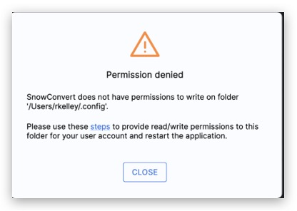

If you do please follow the [directions in the FAQ](https://docs.snowconvert.com/sc/general/frequently-asked-questions-faq#how-do-i-give-permission-to-snowconvert-config-folder) to resolve this issue.

When you open the application it may prompt you to update it, if an update is available please update the application:

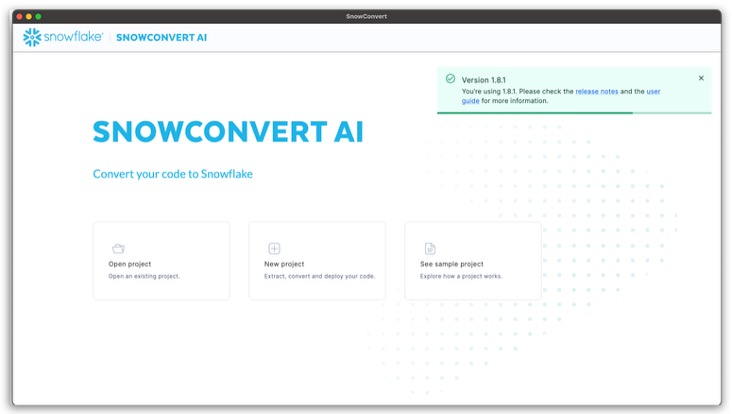

Go ahead and update the tool if needed. When working with the application, it is generally better to keep it as up to date as possible. This is a local application. Keeping it up to date not only ensures the functionality of the application, but also ensures that you have the most up to date version of the conversion core.

Create a new folder in your Documents folder (or wherever you want so it is separate and accessible) on your machine called 'Snowconvert'

Going back to SnowConvert Select New Project.

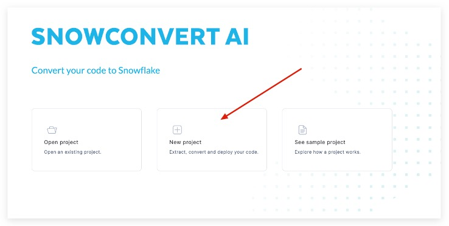

To begin using any version of SnowConvert, you will need to create a project. Think of a project as a local config file that will be saved to your machine. This will preserve any settings and will allow you to continue where you left off if you need to step away.

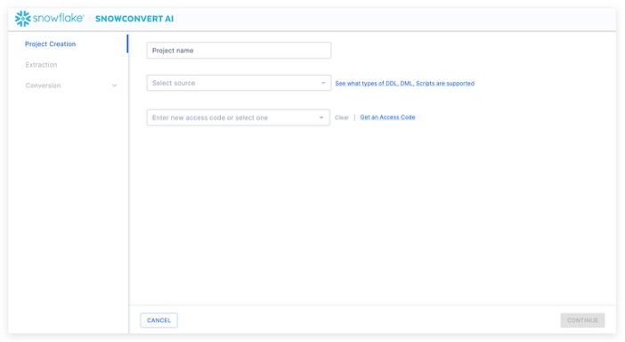

Let's call our project: **SQL Server ADW Test**

We then need to select a source. In this case, it is SQL Server.

To run any element of a project in SnowConvert, you will need to provide an access code. Unless you have used SnowConvert before, you will need an access code. Happily, you can request access in the tool by selecting "Get an access code" next to the access code drop down.

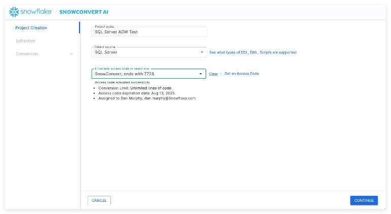

Note that if you have already activated an access code, you will see options in the dropdown menu in the license screen as shown here:

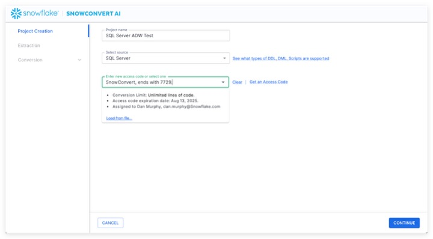

You can choose an access code from this list if you have already activated one.

Assuming we do not yet have an access code, let's request an access code. Choose "Get an access code" from the menu to the right side of the dropdown menu. When you do this, the access code form will pop up:

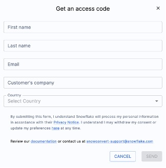

This information is needed to confirm who you are to Snowflake. Once you complete the form, you will receive an email with an access code. It will look something like this:

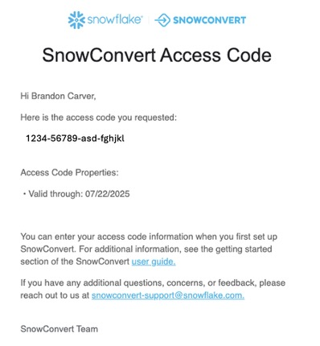

Paste this access code into the application where it says "Enter new access code or select one" in SnowConvert. When your access code has been accepted, you will get a small message under the dropdown menu that says "Access code activated successfully".

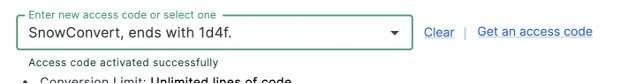

You will need to have an active internet connection in order to activate your access code. If you are unable to activate your access code, check out [the troubleshooting section](https://docs.snowconvert.com/sc/general/frequently-asked-questions-faq#why-am-i-not-receiving-an-access-code) of the SnowConvert documentation.

Now that we're active, let's Extract!

## Step 2: Extract

From the Project Creation menu, select the blue "GO TO EXTRACTION ->" button in the bottom right corner of the application. This will prompt you to create a connection to a SQL Server account and database.

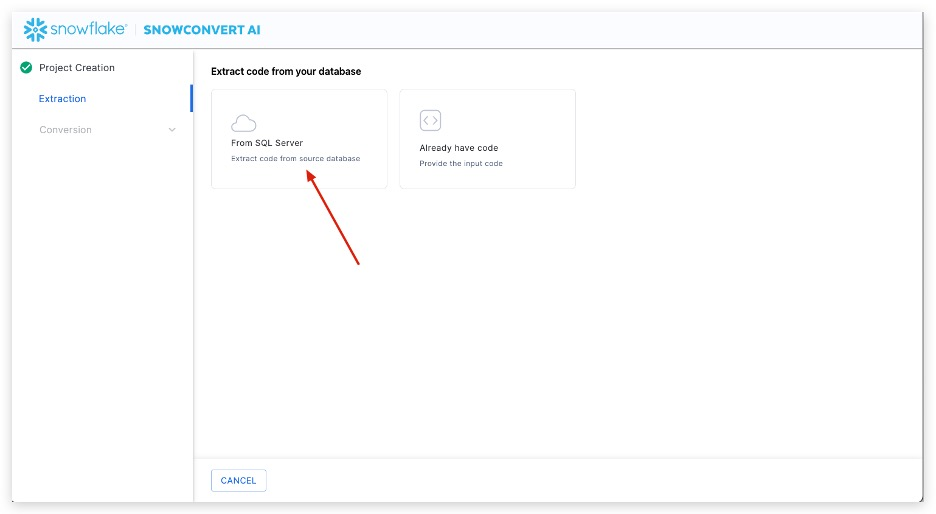

The "From SQL Server" form will launch:

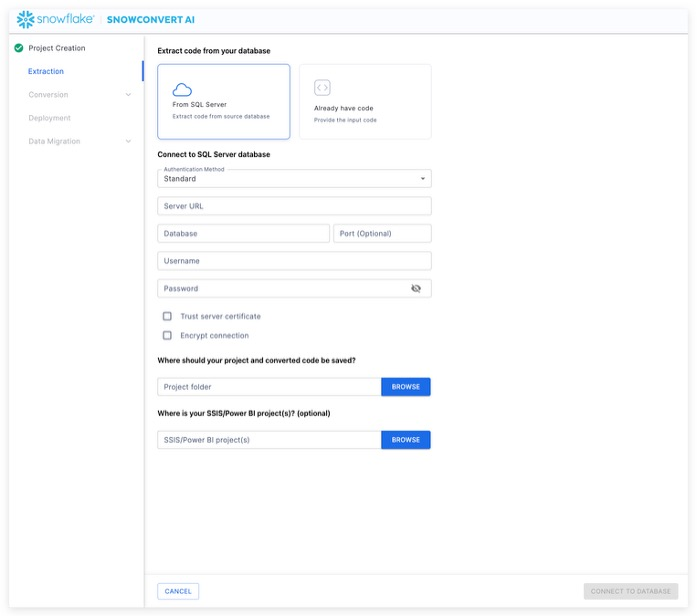

Here is the connection information we're going to use:

- Authentication Method: **Standard**
- Server URL: **snowconvert-datamigration.database.windows.net**
- Database: **AdventureWorks**
- Port: **1433**
- Username: **demo_user**
- Password: **Secure12345!ForDem0**

Check both boxes for "Trust Server Certificate" and "Encrypt Connection".

Now we will have to specify a local path for our project folder. Anything that we do in SnowConvert will be preserved in this project path as well as anything that is created locally. Choose a path that is fully accessible to you. This is the directory we created before this in the Documents folder and 'SnowConvert. In my case my full project parent folder path is: /Users/damurphy/Documents/Snowconvert/

You will get a pop up that says "Connect Established" when you have connected. SnowConvert will then take you to the catalog screen:

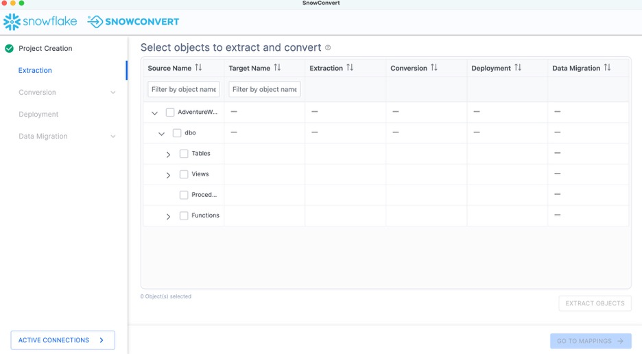

The catalog screen allows you to browse objects that were found in the database. For SQL Server, this could be tables, views, procedures, or functions. Nothing has been converted yet. This is merely an inventory of what SnowConvert found in the source.

Using the catalog, we can select a set of objects for which we'd like to extract the DDL. Using the filter options, you can search for a specific object or set of objects. Using the checkboxes, you can select a specific subset of objects or select the highest checkbox to select everything:

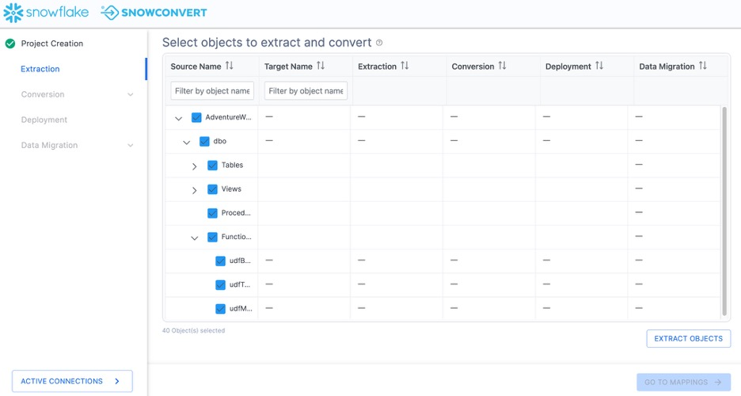

In this example, we will select the top checkbox and select everything. This will include tables, views, and functions. Then select "EXTRACT OBJECTS" to extract the DDL.

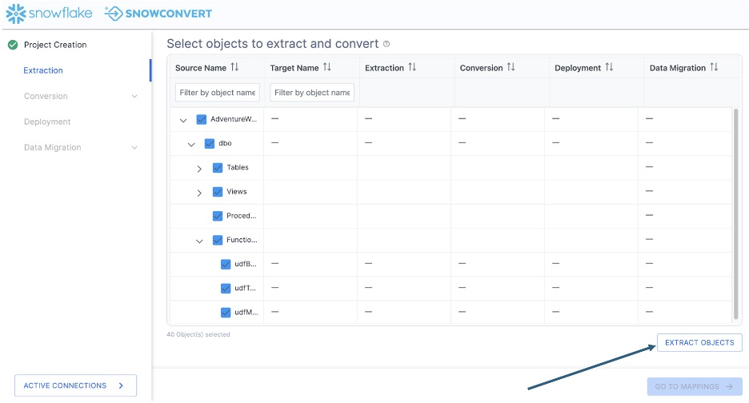

This will create a folder on the local machine preserving the structure of the objects in the database with a file for the DDL for each object.

When the extraction is complete, you will see a results screen similar to this:

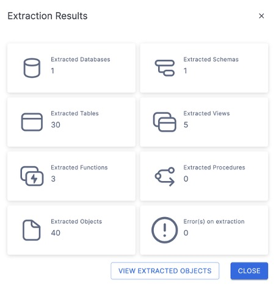

This will give you a brief overview of what was extracted. If there were errors or something was not able to be extracted, it will be reported to you here.

You can select "VIEW EXTRACTED OBJECTS" to see where SnowConvert put the extracted DDL.

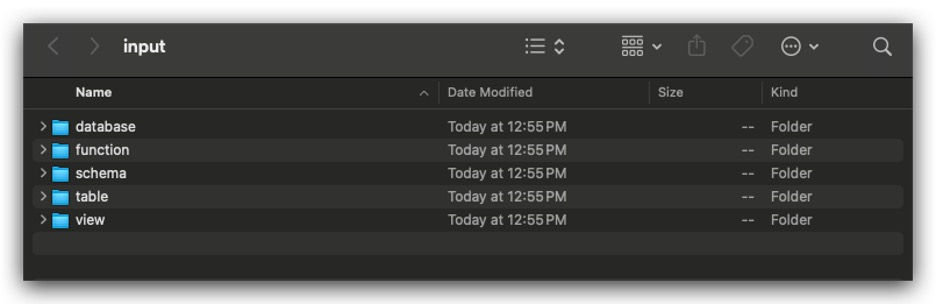

But since the number of objects we have extracted matches what we expected and there are no errors, we can **close** this dialog menu and return to the catalog.

Note that now we can see a green checkbox where the DDL was successfully extracted for the object:

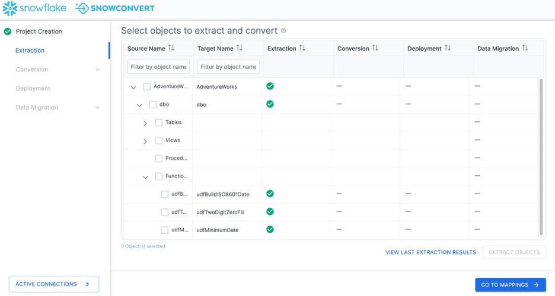

If there was an error extracting the DDL, you would see a red X and would need to resolve why that was not extracted.

## Step 3: Conversion

At this point, we've extracted the objects in the database and we're ready to assess the compatibility with Snowflake and begin the conversion process. There are some optional steps we can do before we get to the conversion itself. Let's take a look at this by selecting "GO TO MAPPINGS ->" in the bottom right corner of the application.

This brings us to the mapping screen.


On this screen, you can choose a new name for a specific object in Snowflake (i.e. map a single object from SQL Server to Snowflake). You can also choose BULK MAPPING to apply a prefix or suffix to all of the objects or a subset of them (such as tables or view).

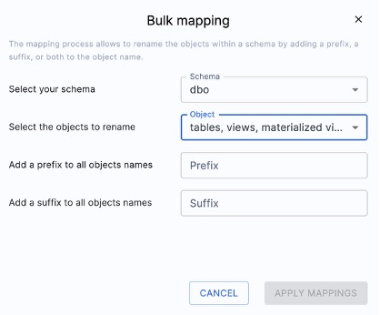

Note that this is completely optional when doing the migration. In this scenario, we will not do any custom mappings. **We will not do this** for the lab, but it is good to know that it is available. At the time of writing this lab, changing object names may have an adverse effect on dependent objects like views. For example, if I change a table name I will have to change the view definition to match the new table name. We plan on catching this in the future but at this time it is not the case.

Since we are leaving our object names unaffected, let's start the conversion process. Select "START CONVERSION" in the bottom right hand corner of the application.

You will view an error message similar to this one:

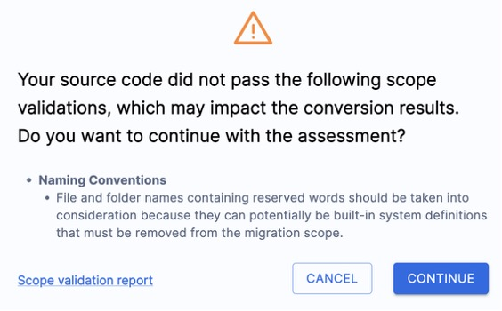

This simply means that SnowConvert has scanned the code that it extracted from the database before it runs its conversion script, and has found some things that COULD cause errors. It will tell you some things you might want to change in the source before converting. These can be found in the "Scope validation report" that you can read. In this scenario, **we'll just click "CONTINUE".**

SnowConvert will then execute its conversion engine. This is done by scanning the codebase and creating a semantic model of the source codebase. This model is then used by SnowConvert to create the output Snowflake code as well as the generated reports.

When the conversion is finished, each step will be highlighted:

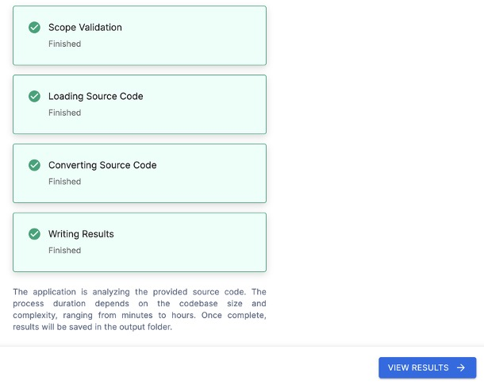

Select "VIEW RESULTS"


The results page will give you a code completeness score initially, but there is more information below if you scroll down. There is more information on each element of the output report [in the SnowConvert documentation](https://docs.snowconvert.com/sc/general/getting-started/running-snowconvert/review-results), but we'll just highlight a few elements of the report for this lab, and we'll do the followup for each of them which will explore more in depth.

**Code Completeness**: This is a reference to any missing elements or objects that are not present in the codebase. If you have 100% code completeness, then you do not have any missing objects or references to missing elements in the codebase.

Let's visit the additional reports that are generated by SnowConvert. Select "VIEW REPORTS" from the bottom of the application:

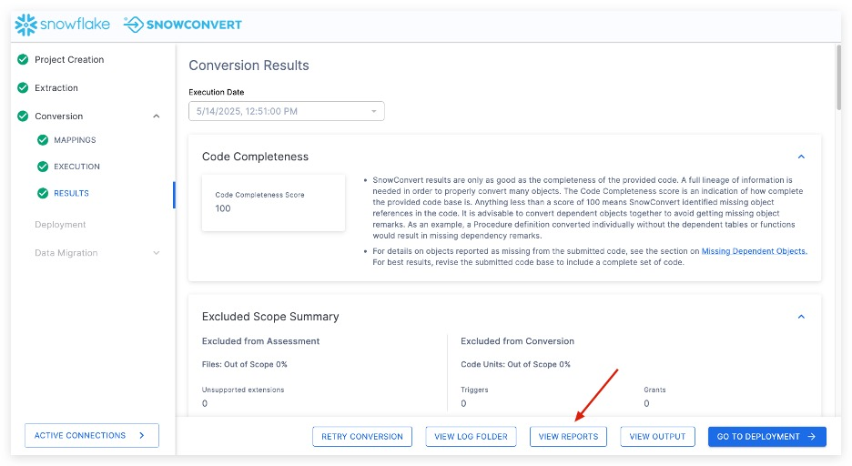

Here we can see all the files generated from the migration including Missing Objects or Issues or Elements. Since this is a demo most files are empty except for the Issues file which has a few items listed:

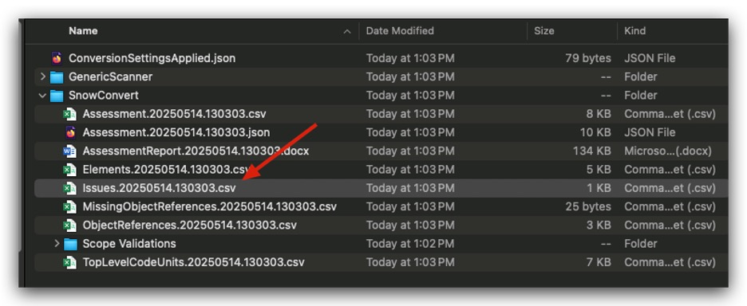

This is the contents of the Issues CSV file for your reference:

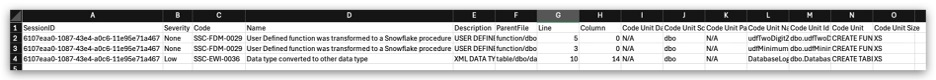

In this scenario, we have 100% code completeness. This makes sense given that we are exporting this directly from the source. If you do have missing objects here, the recommendation would be to open the reports folder and validate that the missing objects are either known to be missing or find the DDL for this object.

**Conversion Overview**: Now that we have seen that we have the code that we need for this, let's see how much of our code was converted. Let's review the Code Units Summary section. This section is in the main window just scroll down in the conversion results page:

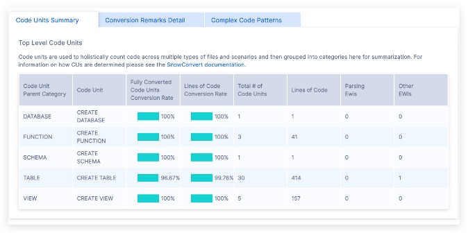

Looks like we have tables, views, and functions in this codebase, but not a lot of code in general (this looks like less than 1000 lines of code in total). There also is only one "EWI's" (in the last column), meaning that the majority of this extracted DDL can be moved over to Snowflake just by using SnowConvert. We'll look through the EWI's in a moment.

Understanding what we have is essential to successfully completing a migration. If we were pre-migration, we would likely stop here and review the object inventory. We'd also want to run the Snowpark Migration Accelerator (SMA) to validate that any pipelines we have include the objects that we are migrating here. In this scenario, we are going to go ahead and move forward to work through any issues that we have and will run the SMA later.

Since we have a good understanding of what needs to be done and it's relatively small, let's go ahead and attack this. Let's resolve the issues that we have present. Before we do that, let's take a look at the status in our object inventory. Select "GO TO DEPLOYMENT" in the application.

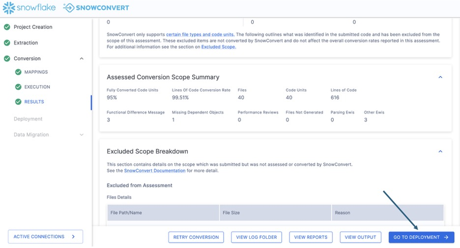

## Step 4: Deployment

This will take you back to the inventory screen. It should look something like this:

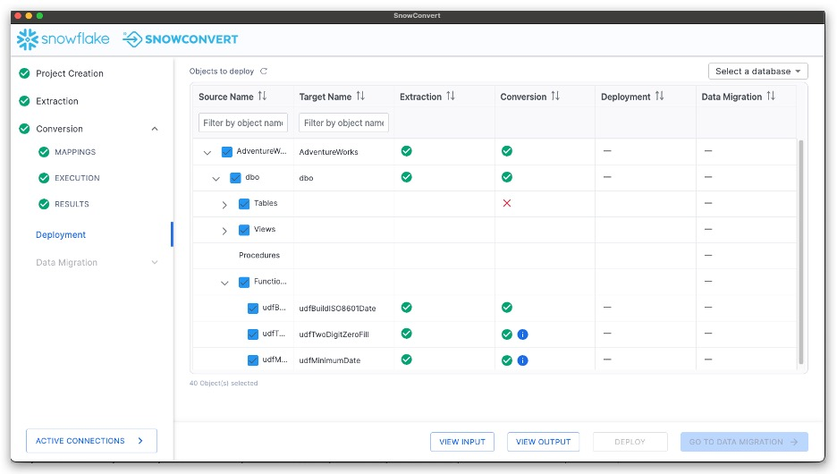

This is the same inventory that we have already seen, but note that now we can see a status in the conversion column. There are a few different elements that we can see here that are based on the conversion status. This lets us know which objects were fully converted (a green checkmark), which objects have a warning that you should consider (a green checkmark with a blue "i" icon), and which objects have a conversion error that must be addressed (a red "X").

These statuses are determined by the error messaging that SnowConvert has placed into the converted code. The objects with a red "X" have an error message that will produce an error if you attempt to run that SQL in Snowflake. If you resolve the errors, then you will be able to deploy the output code. As long as the converted files remain in the same directory where SnowConvert initially placed them after the source code conversion, SnowConvert will maintain its connection to your project directory.

Let's see this in action by resolving the issues.

### Resolving Issues (powered by AI)

SnowConvert will generate an inventory of all issues that it encounters. This is in the **issues.csv** file. Let's take a look at issues that we have available in this execution of SnowConvert.

To find the issues report, go to "VIEW OUTPUT" in the bottom of the SnowConvert application.

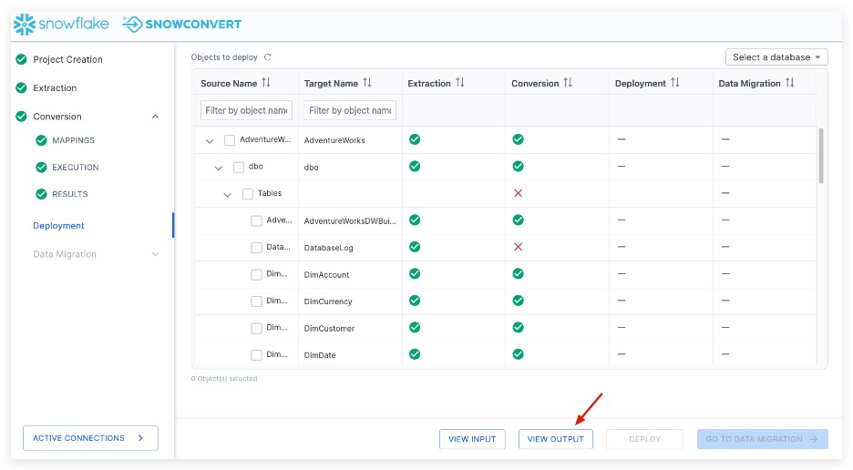

This will take you to a directory title "Conversion-\<datetime\>" within the directory you originally created in the project creation screen at the start of the project. This output will have three different sub directories:

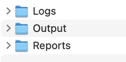

Let's first visit the reports directory to see what issues SnowConvert identified with this conversion.

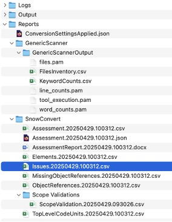

The issues.\<datetime\>.csv report will be available in the reports folder under the SnowConvert subfolder. In this report, you will find the type of each error as well as its location and a description of the error. There are three major types of error generated by SnowConvert:

- **Conversion Error (EWI)**: generally, this is something that the tool could not convert or hasn't seen before
- **Functional Difference (FDM)**: this is code that has been converted, but may be functionally different in Snowflake. These errors should be treated as warnings, but paid close attention to during testing.
- **Performance Reviews (PRM)**: this is something that SnowConvert identifies that will run in Snowflake, but may be suboptimal. You should consider optimizing this once you're up and running in Snowflake.

There's more information on each of these [in the SnowConvert documentation](https://docs.snowconvert.com/sc/general/technical-documentation/issues-and-troubleshooting). Let's look at what we have in this execution:

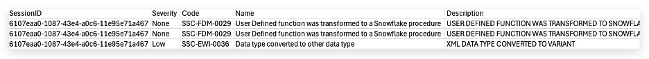

We can see that some issues share an issue code, but we can see specifically which file has the issue in it and a description of what the issue is. This is a very low number of issues. There will not be a ton of things to work through.

There are many approaches to dealing with the conversion issues generated by SnowConvert. We would recommend that you start in the same order you would want to deploy the objects: tables first, then views and functions, followed by procedures and scripts. You could pivot this table by the root folder (which will have the object name in it), then sort by severity and type. Depending on your timeline and business need, this would allow you to deal programmatically with the most critical issues in the order of deployment.

However, in this lab, there are such a small number of issues, we don't really need to pivot this file. However, we will still start with the same approach. Where are we going to deal with these issues? Snowflake would recommend that you use the Snowflake Visual Studio Code Extension, and that is what we are going to use right now.

Throughout this lab, anytime that we are going to interact with the code, we are going to use the **Snowflake extension for VS Code**. We can open it now and leave it open for the duration of this lab. If you have not yet downloaded [the VS Code extension](https://docs.snowflake.com/en/user-guide/vscode-ext), you can do so from within VS Code or from [the VS Code Marketplace](https://marketplace.visualstudio.com/items?itemName=snowflake.snowflake-vsc).

When you first open VS Code, navigate to the settings for your extensions. In the settings for the Snowflake extension, you will need to enable the SnowConvert Migration Assistant:

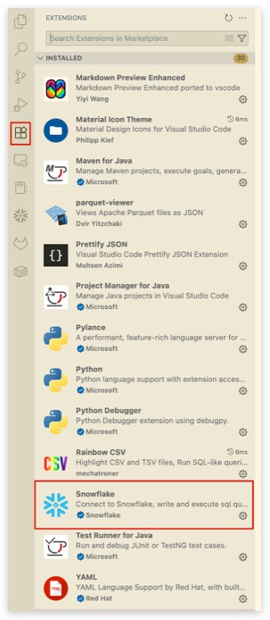

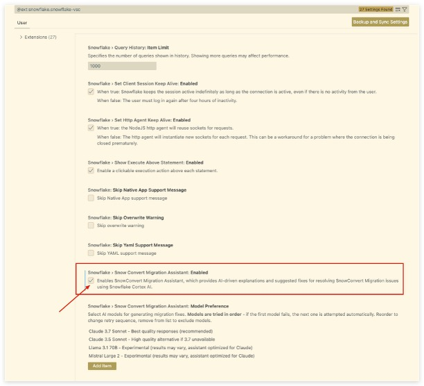

When you enable SnowConvert Migration Assistant, VS Code may prompt you to restart. Even if it doesn't, it's a good idea to restart the application now.

Go to the explorer in the top left corner of VS code and 'Open Folder' and select the folder we created earlier. If you already have something in your explorer you can go to File>Open Folder and then select your Folder

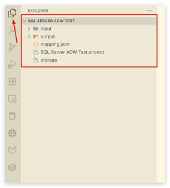

Open the Snowflake extension and login to your Snowflake account. Remember to be **logged into the VPN** for this lab and remember to **be ready for Duo MFA**

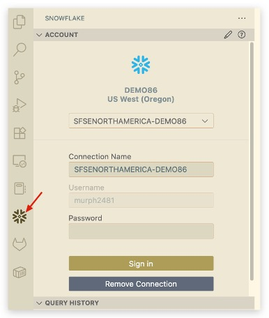

If you have already connected your snowflake account before in VS Code go ahead and choose your account and log in. Be ready for your **MFA Duo confirmation** to come on your phone when you log in.

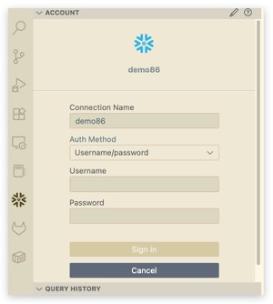

Once you are logged in you can confirm this in the object explorer by seeing objects from your Snowflake account:

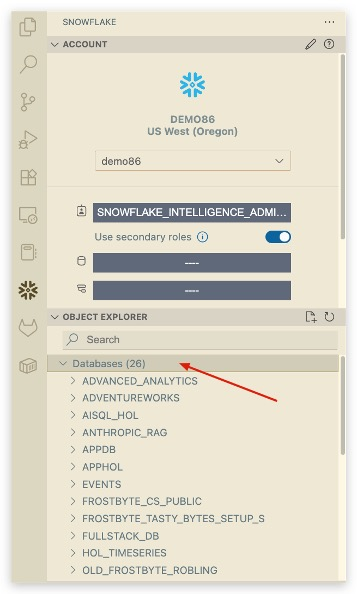

If you have not connected VS Code to your account just click sign in for another account and enter in your information. You can use the 'Connect a tool to Snowflake' dialog in snowsight to get your account identifier information

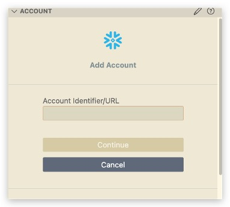

In Snowsight get your account information:

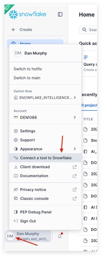


Place this in your Snowflake login credentials for VS Code

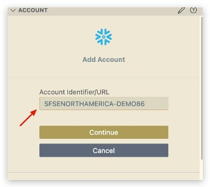

Then enter your username and password and wait for the authentication MFA from Duo on your phone:

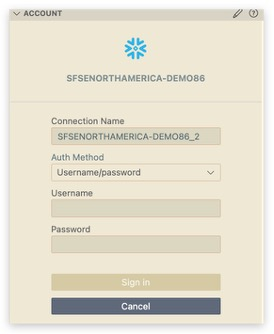

Let's look at some of the files we have available to use that SnowConvert made for us.

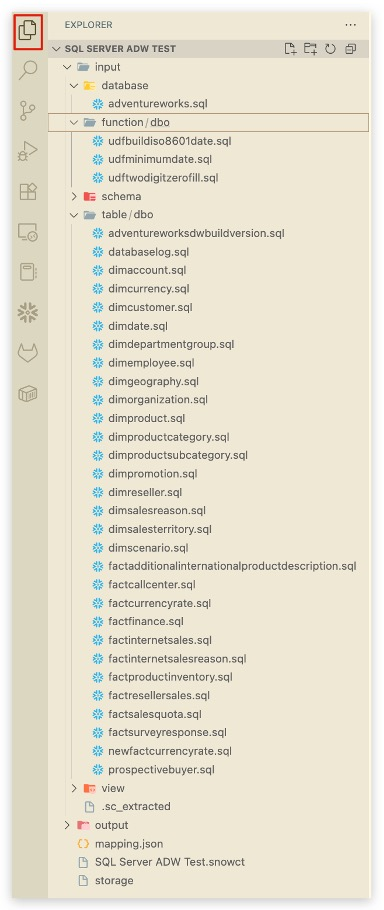

The extracted code is in the input directory, and the Snowflake code generated by SnowConvert is in the output folder. But we will not need to navigate this folder structure to find our issues. We can use the Snowflake extension.

Open the Snowflake extension, and you should see a section called "SNOWCONVERT ISSUES". It should already be connected to the projects output folder

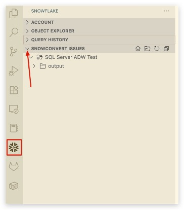

Then select this folder by clicking 'select migration folder'. You will then see the SnowConvert Issues section is now populated with the issues it found during the conversion.

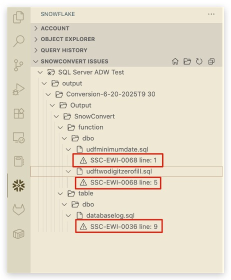

You can see each of the files that has an EWI in it and the exact location.

Note: for most migrations, this will be exceptionally large. It would be good to plan how to approach the issues using the **issues.csv** spreadsheet as mentioned earlier.

If you select a specific error, it will take you to the place in the code where that error can be found:

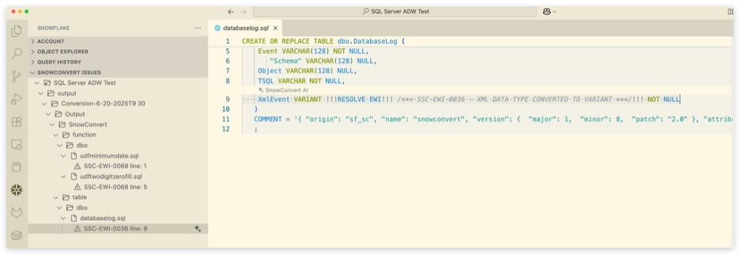

Let's start with the databaselog.sql file with the EWI error on line 9

This error is an EWI saying that a datatype was converted to a different datatype in Snowflake. This doesn't look like a problem, but more looks like SnowConvert is trying to tell us to validate that this is not a problem before we deploy.

If we're not sure that this datatype should be converted to VARIANT, let's use the SnowConvert Migration Assistant to generate some more information on this error. To do this, let's select the starburst icon in the SNOWCONVERT ISSUES menu in the extension:

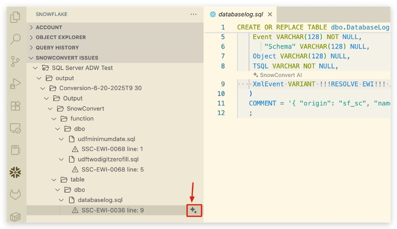

Note that a new window will pop up saying "Loading explanation and suggestion...". This is connecting to your Snowflake account and passing the error message that SnowConvert generated to Cortex in your connected Snowflake account. It will give you an explanation after it has had a moment to think through it:

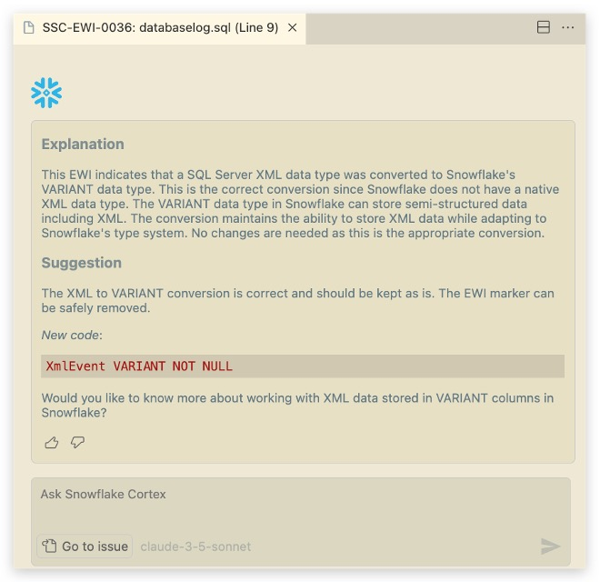

This explanation seems to validate that the conversion is correct. VARIANT is the right translation for an XML file. From this menu you can:

- copy the replacement code that it has generated
  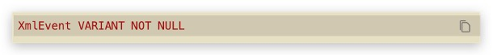

- chat with Cortex
  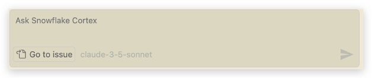

- return to the issue
  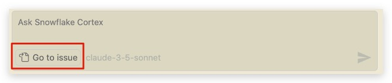

Let's say that we are not sure that this is the right conversion. We could ask Cortex if there are any other options for XML data in Snowflake using the interface.

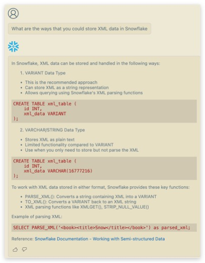

Your results may vary, but this is what Cortex returned to me. VARIANT is still the recommendation. We'll take a look that the data matches depending on how we are using this XML data when we test the result of this conversion.

For now, let's replace the code with the EWI with the code that Cortex has recommended (which is essentially, to remove the EWI notation in line 9, which is everything in the !!! and commented section leaving only **XmlEvent Variant Not Null**). Our new code looks like this:


Now save the edited file and the EWI message is gone.

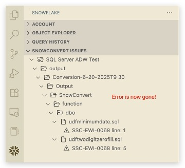

We can see this same behavior in the SnowConvert application. If you return to the application, we should still be on the deployment screen. If you expand the "Tables" section of the deployment screen, you will see that "DatabaseLog" is marked with a red "X" indicating that it cannot be deployed.

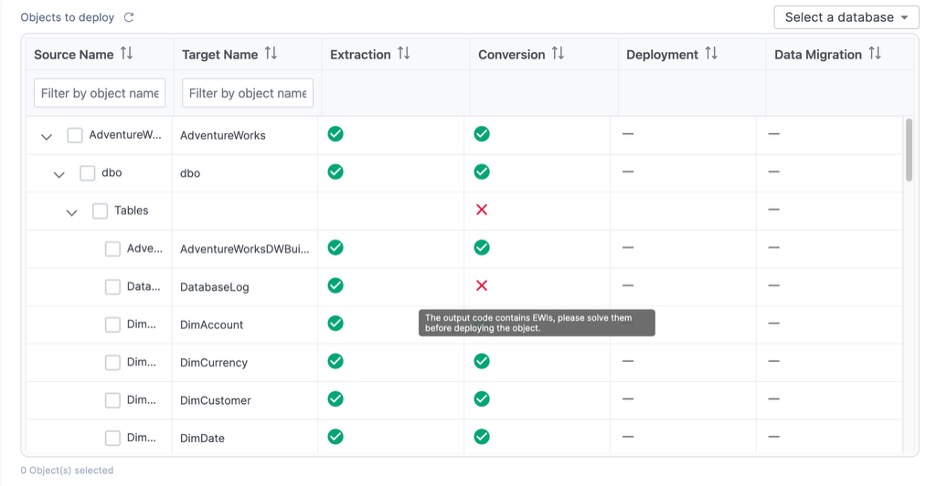

However, now that we've resolved the EWIs in the DDL for that object, we can refresh this list by selecting the refresh icon in the top left of the application:

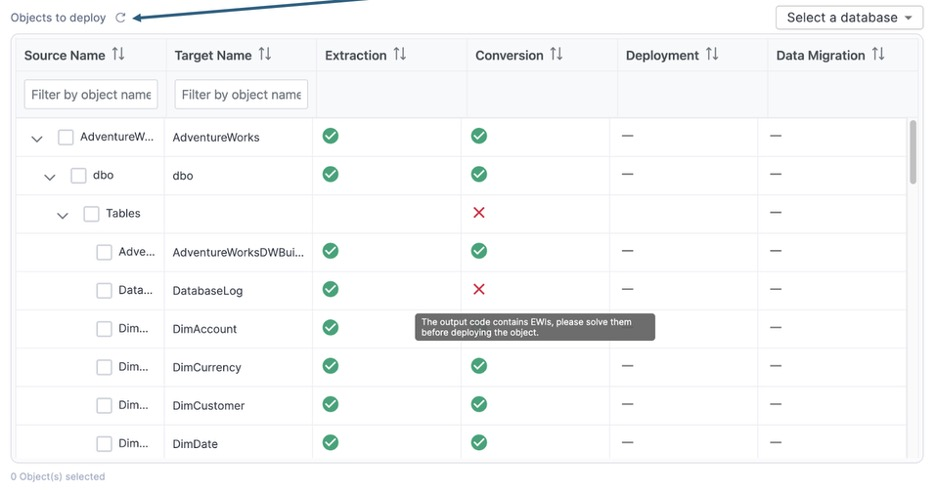

We should see that the red "X" now changes to a green checkmark:


If it does not change, then there are still errors associated with that DDL that need to be resolved. That does not appear to be the case here.

We can now continue to resolve the rest of the errors in our execution. The tables now all appear to have their issues resolved. (You can validate that they are ready to deploy by scrolling through the catalog in SnowConvert to see that all objects are marked with a green checkmark.)

Let's take a look at the remaining issues we have:

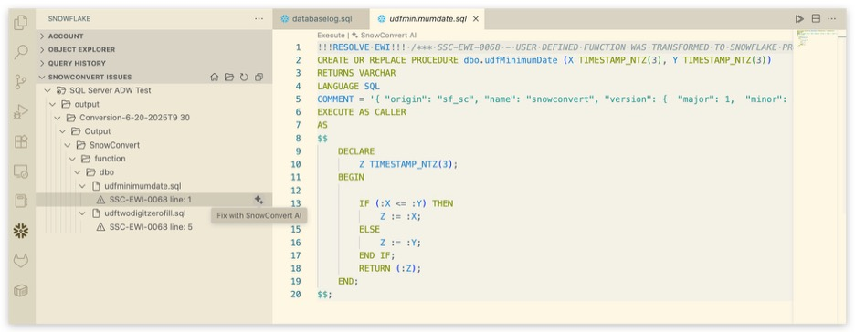

We have two remaining issues in two different views, but they have the same error code. Note that this is also a EWI code, so there may not be a solution we need to apply here. Let's select the first issue and call Cortex to tell us more about it.

This is an interesting issue. SnowConvert has decided that this UDF should be turned into a stored procedure. This is an interesting decision as a stored procedure cannot be called in the same way as a function. But there are things that you can do with functions in SQL Server that you cannot do with a function in Snowflake. And if you ask Cortex what it thinks, it will disagree with SnowConvert and turn this back into a UDF:


This is where you need someone familiar with how this function is used across the workload. Normally, we would inventory any reference to this function across the entire workload. Since this is a small POC, this function is not used anywhere else. You can validate this in a couple of ways. The first is to simply search for the name of this object in the input directory in VS Code:

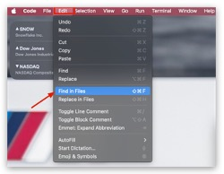

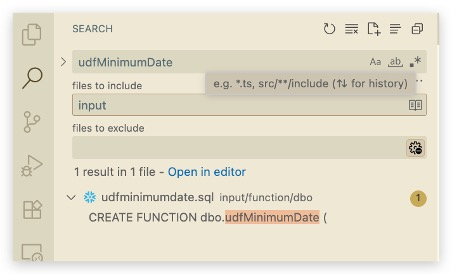

There is only reference to this function and it is in the create function statement. So it is not being used anywhere. We can also check the dependent objects inventory generated by SnowConvert. (You could do this in a file browser or in VS code directly.)

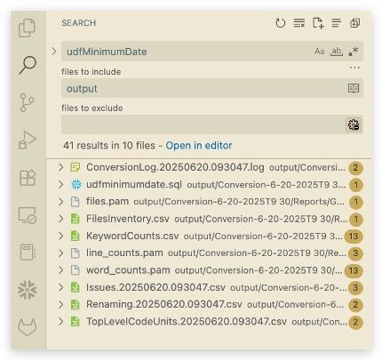

We can see that while there are many mentions of this object in the reports, there is no mention of this object in the **ObjectReferences.\<datetime\>.csv** report. As a result, this function is not used anywhere, so we're not sure how this will be called.

So, should we go with what SnowConvert has generated or listen to Cortex? There are advantages and disadvantages to both, but the primary reason would be turning this function into a procedure means it WILL fail if it is called in a way that a procedure cannot be called. This means that you will be immediately alerted to this when you test this output. Leaving it as a function means that there may be functional differences that you may not immediately be aware of.

In this situation:

- Interpreting what the function is trying to do versus the way it is written, I think this could be a UDF.
- It's also likely that this is going to be called in a way that is not going to work for a procedure.

So I'm going to make the choice to use the Cortex recommended code and put in the function code. However... I will add my own comment to the file that contains the code as a stored procedure. That way I can revisit it if I need to when it comes time to test these functions. That looks like this:

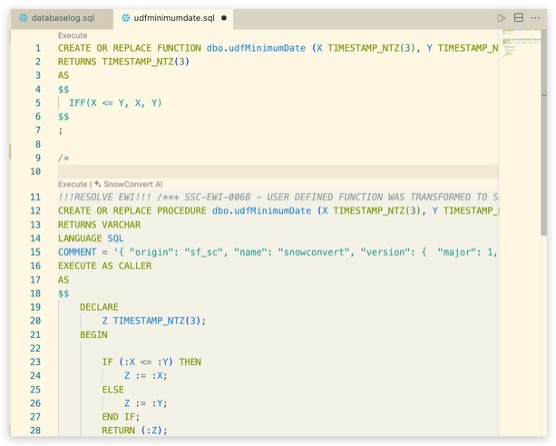

Let's remove line 11 from (the error SSC-EWI-0068) the commented code and save the file. Doing this will remove the EWI issue and we will no longer have any issues with this file (udfminimumdate.sql).

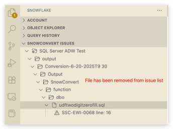

I will collapse this and take a look at the last issue. Since this issue has the same error code as the previous one, it is likely to be a similar case with a similar solution.

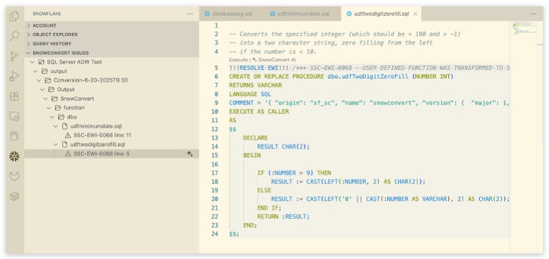

It is a similar issue. This function is doing something slightly different, but I will make the same decision here that I made before to trust that the function will give me the right result, preserve the procedure as a comment, and test this later on.

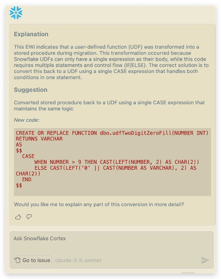

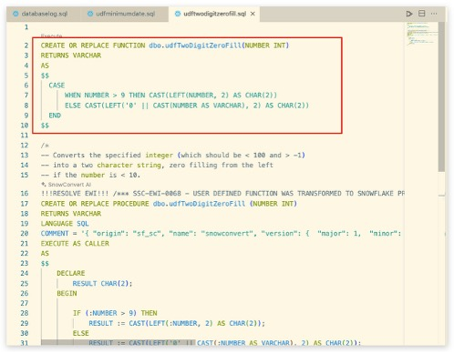

Let's remove line 16 from (the error SSC-EWI-0068) the commented code and save the file. Doing this will remove the EWI issue and we will no longer have any snowconvert issues.

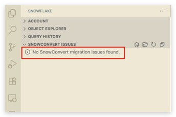

There are a large number of issues that SnowConvert can generate. The ones that we see here are generally something that you need to make a decision on the best solution path for your situation.

Let's validate this in SnowConvert. If you've saved each of the files, you should be able to see checkmarks across all of the objects, though there will still be some blue "i" icon:

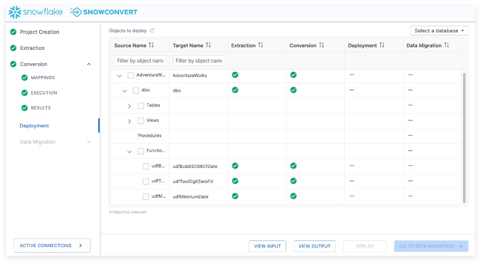

Let's add an active connection so that we can migrate this code to our snowflake database. We can do this by clicking active connections on the bottom left and adding in our snowflake credentials information:

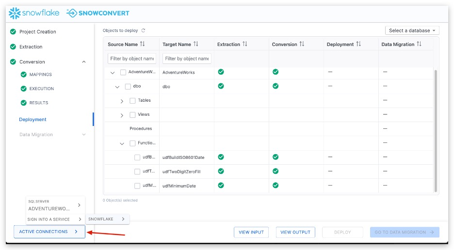

We can use our account identifier to connect to our instance that we used in VS Code, please also choose a valid warehouse that you have access to from that user:

Authentication Method is Standard

Choose any warehouse your user has access to, in my case I am choosing a warehouse named 'Medium'

Role is not required or needed in this case

Be ready for a DUO MFA request!

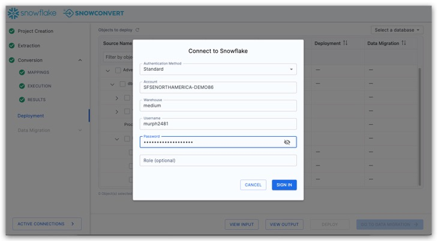

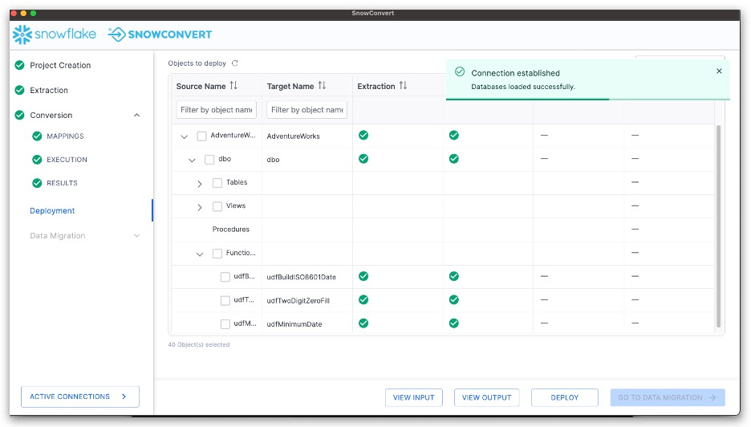

Let's move forward in the process and deploy the code. This will run all of the DDL that we have extracted from SQL Server (and subsequently, resolved any issues with) to Snowflake. Click the upper folder checkbox to deploy the code, then select "DEPLOY" at the bottom of the application:

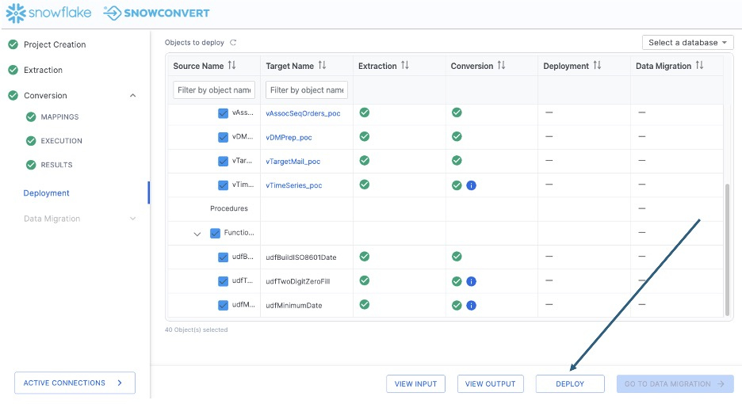

### Deploy objects

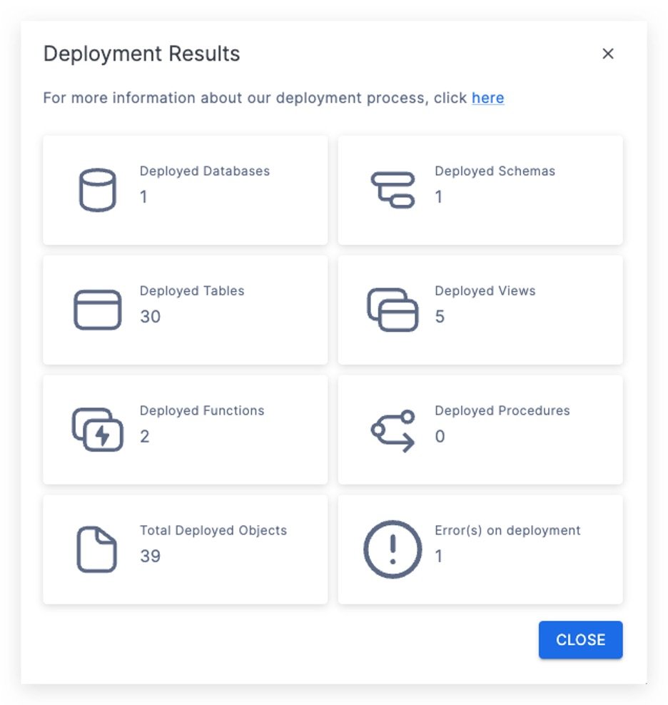

Now, we know there should be more than 1 object here. There is one error on deployment. You may also see an error message like this one:


If you do see this, you can see why the error occurred in the catalog in SnowConvert by hovering your mouse over the top of the error symbol.

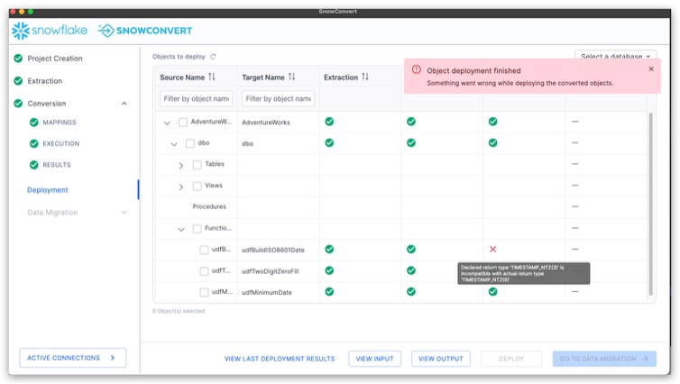

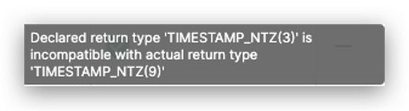

It looks like we need to change a timestamp to match the expected value. Let's go back to VS Code and find the udfBuildISO8601Date.sql and edit this file to change it as expected:

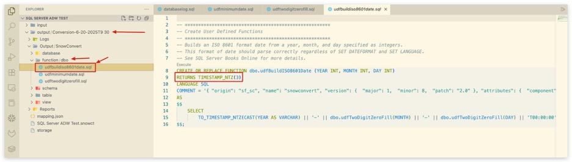

Change the 3 to a 9, as that was the error message we got from Snowconvert during the deployment. Then save the file.

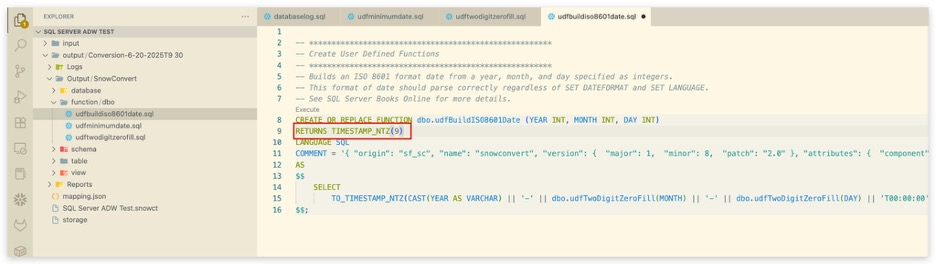

Then go back to snowconvert and run select all objects again and then deploy again. Since the objects all have create or replace in them it should run just fine.

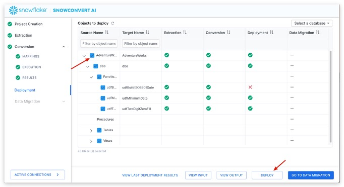

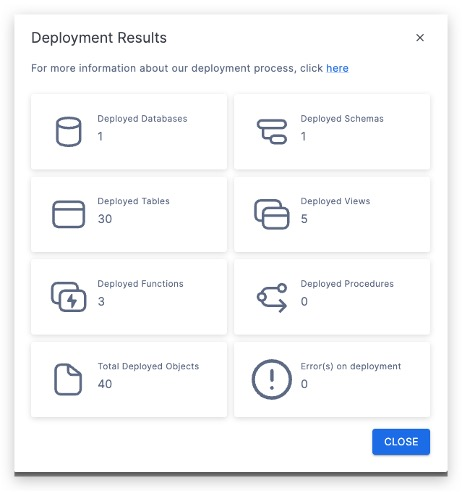

This can be validated by checking the data tab in snowflake and seeing the objects (tables is not expanded as it would take up a lot of space in the screenshot but all table objects are there as well):

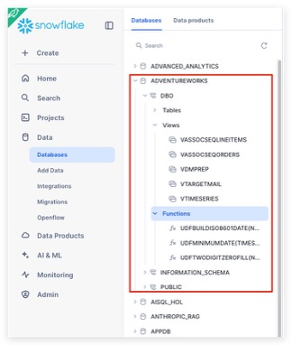

Success! We have all of our tables, views, and functions deployed.

## Step 5: Data Migration

We have officially deployed all of the schema to Snowflake. There's one more thing we can do in the SnowConvert application, and that is move the data from the original SQL Server database into Snowflake. Select "GO TO DATA MIGRATION" at the bottom right of the screen.

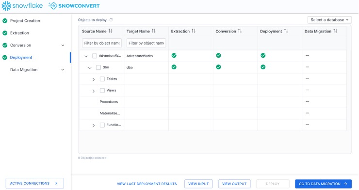

The Data Migration page will give you the same catalog that you can see on the previous screens. For the migration of the data, note that only the data in tables will be migrated. The rest of the DDL is already present, but there is no "data" present in a view or a function, so the tables will be what is migrated. Also note that no data can be migrated to a table where the DDL wasn't already successfully deployed.

To migrate the data, select all of the tables (or you can choose the entire database or schema) and choose "MIGRATE DATA" at the bottom of the application. Be ready on your phone for **multiple MFA requests** that will come through on Duo for authentication

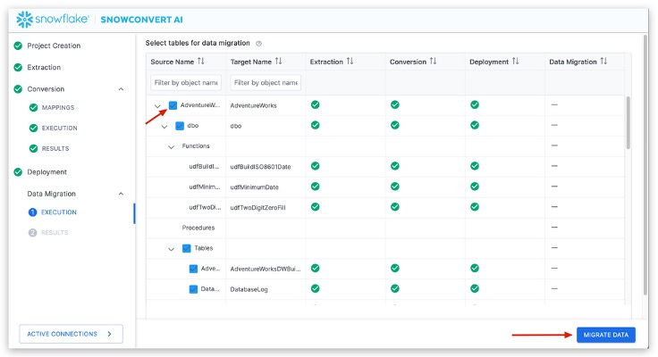

While the data is migrating, it will let you know how it's doing:

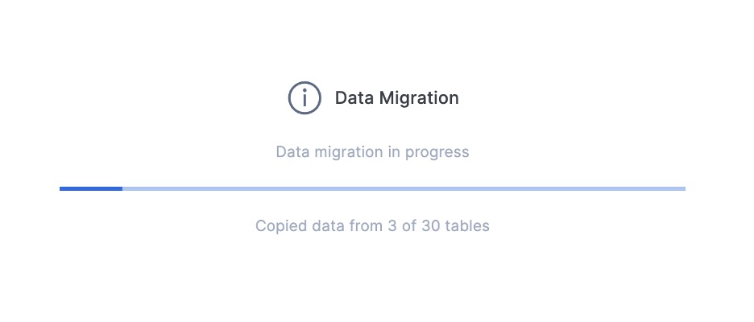

It's important to note that SnowConvert is migrating the data by passing it through your local machine. It is running a select statement on the data in the original object, then doing a COPY INTO to the data in the Snowflake object. This means that the speed of the data transfer will be directly affected by your connection from the local machine where you are running SnowConvert.

If you are moving a large amount of data, this will not be the most efficient way to move that data. You should consider using another data movement or ETL solution. However, in this scenario, this works just fine for us. There are only 30 tables.

Note that if you are connected via SSO, Snowconvert may take you to a login page in your browser. If you have MFA setup on your Snowflake account, you will be taken to your authenticator to validate your connection.

Looks like we did not receive any error message for this migration. Let's expand the object catalog to see if all the tables were migrated:

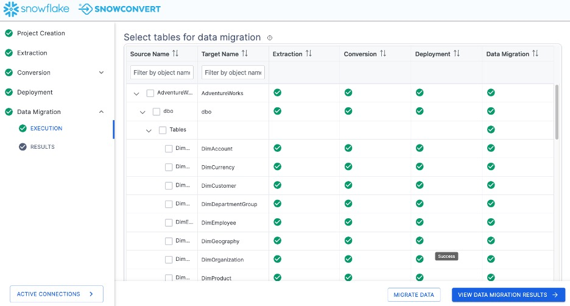

Select "VIEW DATA MIGRATION RESULTS" to see a summary of what just happened.

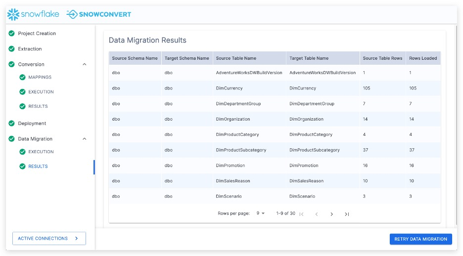

This will show you each table that you just migrated and the corresponding table in Snowflake. For a basic validation of what just happened, you can review the last two columns of the Data Migration Results. These are the row counts for the source table and the count of rows that were loaded into the table in Snowflake.

You can go into Snowflake and write a queries to check to see if this will work. Here is a simple "**select \* from adventureworks.dbo.FactProductInventory;**" on the largest table we loaded:

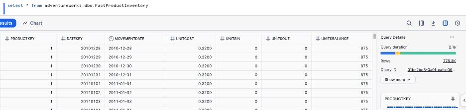

Where once there was no data, now... there is data. At this point, we would start running validation tests on the data to confirm that everything is the same. For this POC, we only have a few tests that we want to validate, but they are all related to the pipelines we are running. Let's do our validations once we move the pipelines.

Note that Snowflake has a data validation capability that is in Private Preview right now. Ask your HoL leaders about enrolling in this PrPr.

## Review

Before we get to our pipelines, let's take a quick look back.

If we review the steps that we did, let's see how they fit in with our migration process:

- Setup our project in SnowConvert
- Extracted the schema from the source database
- Ran SnowConvert's assessment and conversion engine on the extracted schema
- Reviewed the output reporting to better understand what we have
- Reviewed what could not be converted in the VS Code Extension
- Generated new code in the VS Code Extension
- Deployed the code to Snowflake
- Moved the data from the source to Snowflake
- All the while, we were able to track things in our object inventory.

This is what we have just walked through. These steps will generally be recommended regardless of how you used SnowConvert.

And you can generally see that most of these activities fit our **assess** -> **convert** -> **validate** flow:

- Setup our project in SnowConvert **so we can better assess what we have**
- Extracted the schema from the source database **so we can see what kind of DDL we are working with**
- Ran SnowConvert's assessment and conversion engine on the extracted schema **to analyze what we have for our initial assessment, and generate the output converted code**
- Reviewed the output reporting to better understand what we have **to build our assessment of what we have**
- Reviewed what could not be converted in the VS Code Extension **to assess what work needs to be done**
- Generated new code in the VS Code Extension **to resolve any errors in the initial conversion**
- Deployed the code to Snowflake **to validate that the schema works**
- Moved the data from the source to Snowflake **to convert our data into Snowflake data**
- All the while, we were able to track things in our object inventory **to better understand where we are in the migration process**.

## Step 6: DORA Grading

### Configure DORA for Grading

#### Why Use DORA?

- **Automated Grading:** DORA enables SE BPs to automatically grade hands-on curriculum tasks, leveraging the grading framework created by the Training team. Developer Relations also uses it for event labs.

- **Functionality:** DORA allows SE BPs to write tests that validate the completion of hands-on steps and track progress toward certification.

#### DORA API Integration Setup

1. To submit grading requests via external functions, follow the steps below in a new **SQL worksheet** in your Snowflake account.

```sql
USE ROLE ACCOUNTADMIN;

-- Create API integration
CREATE OR REPLACE API INTEGRATION dora_api_integration
API_PROVIDER = AWS_API_GATEWAY
API_AWS_ROLE_ARN = 'arn:aws:iam::321463406630:role/snowflakeLearnerAssumedRole'
ENABLED = TRUE
API_ALLOWED_PREFIXES = (
'https://awy6hshxy4.execute-api.us-west-2.amazonaws.com/dev/edu_dora'
);

-- Confirm integration
SHOW INTEGRATIONS;

-- Create utility database
CREATE OR REPLACE DATABASE util_db;

-- Create greeting function
CREATE OR REPLACE EXTERNAL FUNCTION util_db.public.se_greeting(
email VARCHAR,
firstname VARCHAR,
middlename VARCHAR,
lastname VARCHAR
)
RETURNS VARIANT
API_INTEGRATION = dora_api_integration
CONTEXT_HEADERS = (
CURRENT_TIMESTAMP,
CURRENT_ACCOUNT,
CURRENT_STATEMENT,
CURRENT_ACCOUNT_NAME
)
AS 'https://awy6hshxy4.execute-api.us-west-2.amazonaws.com/dev/edu_dora/greeting';

-- Replace with your Snowflake details
-- Example:
-- SELECT util_db.public.se_greeting(
-- 'dan.murphy@snowflake.com', 'Dan', '', 'Murphy');

SELECT util_db.public.se_greeting(
'your_email@snowflake.com',
'Your First Name',
'Your Middle Name or empty string',
'Your Last Name'
);

-- Create grading function
CREATE OR REPLACE EXTERNAL FUNCTION util_db.public.se_grader(
step VARCHAR,
passed BOOLEAN,
actual INTEGER,
expected INTEGER,
description VARCHAR
)
RETURNS VARIANT
API_INTEGRATION = dora_api_integration
CONTEXT_HEADERS = (
CURRENT_TIMESTAMP,
CURRENT_ACCOUNT,
CURRENT_STATEMENT,
CURRENT_ACCOUNT_NAME
)
AS 'https://awy6hshxy4.execute-api.us-west-2.amazonaws.com/dev/edu_dora/grader';

grant usage on database util_db to role public;
grant usage on schema util_db.public to role public;
grant usage on function util_db.public.se_grader(varchar,boolean,integer,integer,varchar) to role public;
```

**✅ Expected Output**: You should see confirmation messages after each CREATE statement and be able to run the se_greeting function successfully.

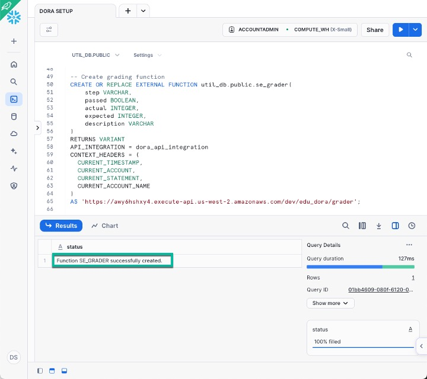

### Validate Using DORA

✅ **Validate Tables and Views were created and moved**

```sql
use database ADVENTUREWORKS;
use schema INFORMATION_SCHEMA;

SELECT
util_db.public.se_grader(
step,
(actual = expected),
actual,
expected,
description
) AS graded_results
FROM
(
SELECT
'SEDW20' AS step,
(
SELECT
COUNT(TABLE_NAME)
FROM
TABLES
) AS actual,
83 AS expected,
'All Tables and Views Created for SnowConvert Lab' AS description
);
```

✅ **Validate Functions were created and moved**

```sql
use database ADVENTUREWORKS;
use schema INFORMATION_SCHEMA;

SELECT
util_db.public.se_grader(
step,
(actual = expected),
actual,
expected,
description
) AS graded_results
FROM
(
SELECT
'SEDW21' AS step,
(
SELECT
COUNT(function_name)
FROM
functions
) AS actual,
3 AS expected,
'All Functions for SnowConvert Lab' AS description
);
```

**If both validations return ✅, you have successfully completed the SnowConvert SQL Server to Snowflake Migration HOL!**
