# Snowflake SnowConvert, Migration from SQL Server to Snowflake HOL

SnowConvert analyzes SQL Server (and other databases) code to predict migration outcomes and identify areas requiring attention. It serves as a migration guide, not a complete automated solution. The Visual Studio Code plugin now integrates Snowflake Cortex, allowing users to directly query for solutions to common migration errors.

## What you will do:

It is recommended that you **DOWNLOAD** this document from compass and run it from your GDrive as that will make copy and paste a lot easier as sometimes formatting can go wrong when copying and pasting directly from compass.

In this lab we will look at the Adventure Works database inside a SQL Server database. We will take a look at the catalog objects (tables, views) and some of the code that is there (stored procedures). Snowconvert will then extract that information and look for possible roadblocks to a migration and processes to consider. It will suggest some solutions but we will find out that the solutions it offers are not a best practice. This is where the GenAI integration of Snowflake Cortex will come into play to help us get possible solutions to this other than what SnowConvert generates programmatically.

We will then take those changes and migrate the structures as well as the data to our snowflake environment.

Below is an outline of the lab:

- Connect to a SQL Server database and pull catalog information
- Generate the input code from SQL Server
- Understand the errors that SnowConvert surfaces
- Resolve those errors using Cortex
- Move the structure and the data to Snowflake

## Why this matters:

- Migration is multifaceted, involving code, data structures, pipelines, and business logic. SnowConvert simplifies code and structure migration. The Snowpark Migration Assistant is intended to aid in pipeline conversions, offering a foundational step for a complex migration process.

- SnowConvert provides a high-level overview of migration complexity, aiding customers in developing detailed migration plans and understanding the scope and effort required. Automated migration tools can underestimate the necessary work due to business rule and technology changes; simply replicating old processes in a new system is often insufficient. The effectiveness of SnowConvert depends on the quality of the data it analyzes and is typically not the only part of a migration to worry about but is a great place to get started

## Step 0: Prerequisites

To run through this lab, you need the following resources:

- SnowConvert - Follow the steps below to download SnowConvert from inside your demo account:
  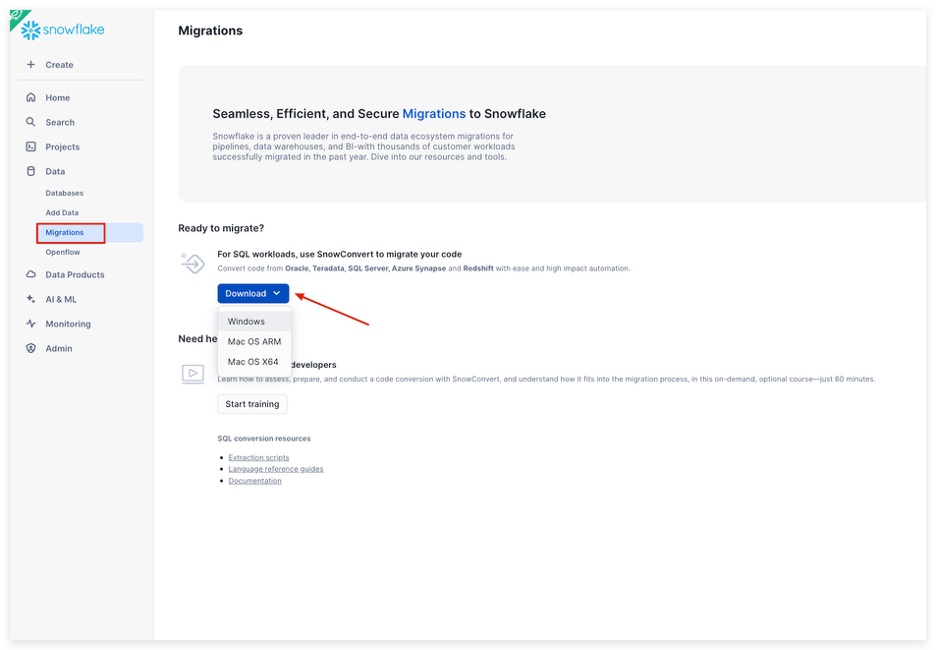

- [Snowflake VS Code Extension](https://docs.snowflake.com/en/user-guide/vscode-ext)

Both of these will run on your local machine. There are settings you will have to change to ensure everything runs correctly, but that will all be detailed in the walkthrough below.

> **Important Note**: This lab uses GenAI, which can produce different results each time, potentially leading to varied errors and solutions. This document addresses common issues, but Cortex-generated code may differ slightly and suggest alternative troubleshooting steps. Remember, you have the necessary skills to resolve any errors and successfully complete the migration. Don't be concerned if your errors or code differ; this is expected with GenAI. Ensure all errors are resolved to successfully migrate data to your Snowflake environment and receive credit.

## Step 1: Project Creation

We have an adventure works database in SQL Server, and we have some spark scripts that load data into the sql server. The customer wants to move all of this into Snowflake.

Open SnowConvert

You might receive this message when you try to open SnowConvert for the first time:

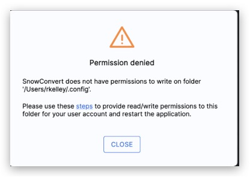

If you do please follow the [directions in the FAQ](https://docs.snowconvert.com/sc/general/frequently-asked-questions-faq#how-do-i-give-permission-to-snowconvert-config-folder) to resolve this issue.

When you open the application it may prompt you to update it, if an update is available please update the application:

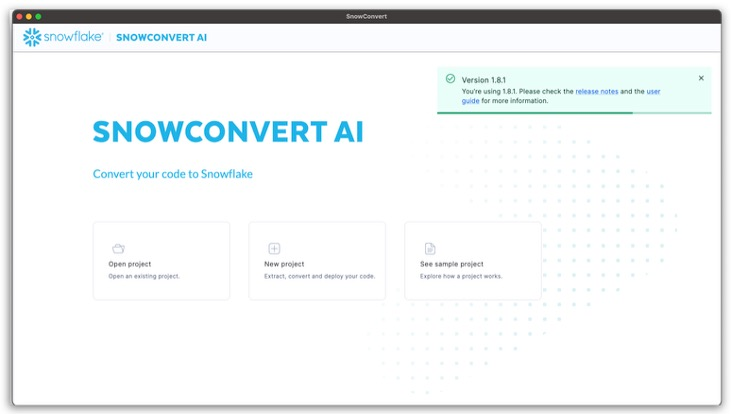

Go ahead and update the tool if needed. When working with the application, it is generally better to keep it as up to date as possible. This is a local application. Keeping it up to date not only ensures the functionality of the application, but also ensures that you have the most up to date version of the conversion core.

Create a new folder in your Documents folder (or wherever you want so it is separate and accessible) on your machine called 'Snowconvert'

Going back to SnowConvert Select New Project.

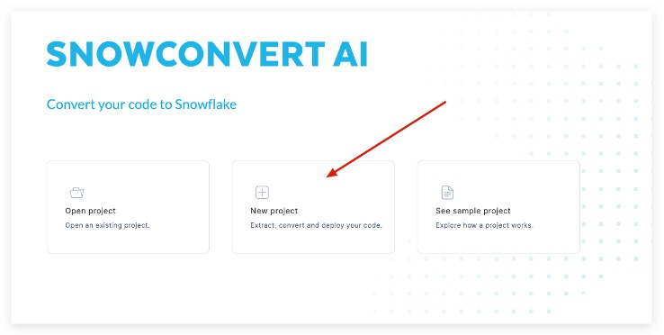

To begin using any version of SnowConvert, you will need to create a project. Think of a project as a local config file that will be saved to your machine. This will preserve any settings and will allow you to continue where you left off if you need to step away.

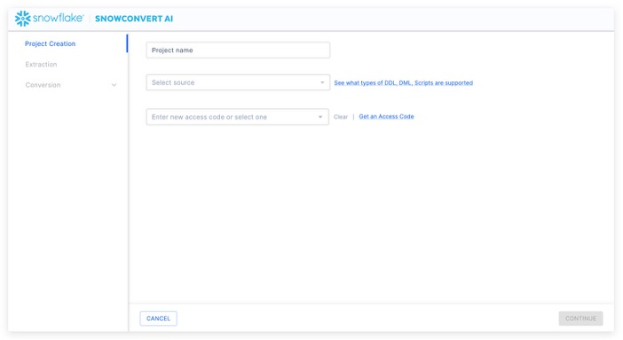

Let's call our project: **SQL Server ADW Test**

We then need to select a source. In this case, it is SQL Server.

To run any element of a project in SnowConvert, you will need to provide an access code. Unless you have used SnowConvert before, you will need an access code. Happily, you can request access in the tool by selecting "Get an access code" next to the access code drop down.

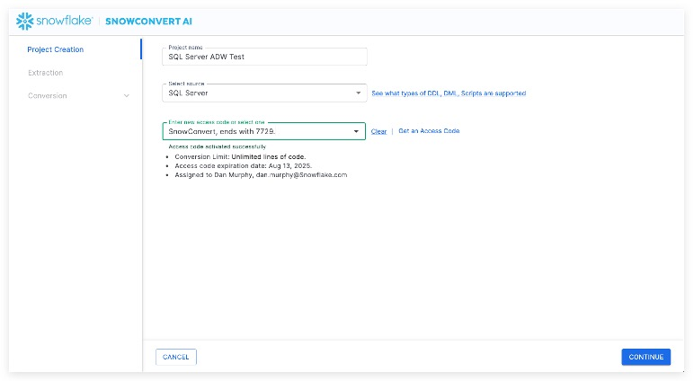

Note that if you have already activated an access code, you will see options in the dropdown menu in the license screen as shown here:

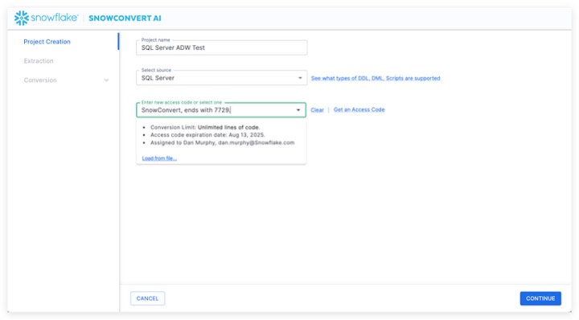

You can choose an access code from this list if you have already activated one.

Assuming we do not yet have an access code, let's request an access code. Choose "Get an access code" from the menu to the right side of the dropdown menu. When you do this, the access code form will pop up:

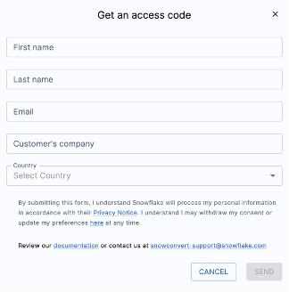

This information is needed to confirm who you are to Snowflake. Once you complete the form, you will receive an email with an access code. It will look something like this:

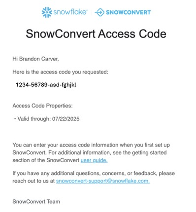

Paste this access code into the application where it says "Enter new access code or select one" in SnowConvert. When your access code has been accepted, you will get a small message under the dropdown menu that says "Access code activated successfully".

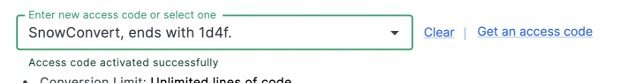

You will need to have an active internet connection in order to activate your access code. If you are unable to activate your access code, check out [the troubleshooting section](https://docs.snowconvert.com/sc/general/frequently-asked-questions-faq#why-am-i-not-receiving-an-access-code) of the SnowConvert documentation.

Now that we're active, let's Extract!

## Step 2: Extract

From the Project Creation menu, select the blue "GO TO EXTRACTION ->" button in the bottom right corner of the application. This will prompt you to create a connection to a SQL Server account and database.

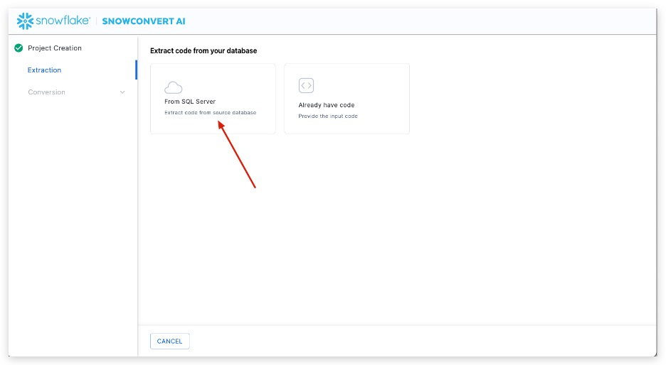

The "From SQL Server" form will launch:

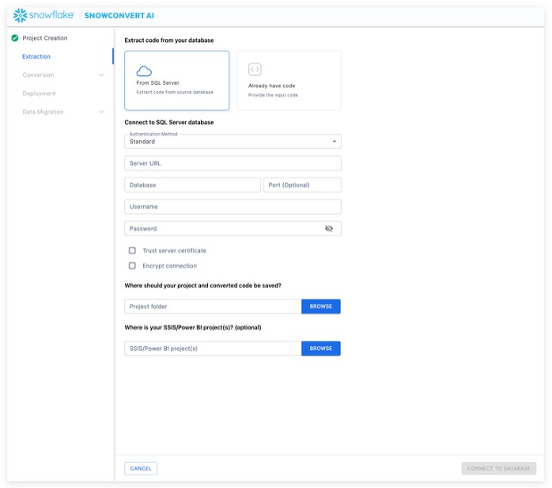

Here is the connection information we're going to use:

- Authentication Method: **Standard**
- Server URL: **snowconvert-datamigration.database.windows.net**
- Database: **AdventureWorks**
- Port: **1433**
- Username: **demo_user**
- Password: **Secure12345!ForDem0**

Check both boxes for "Trust Server Certificate" and "Encrypt Connection".

Now we will have to specify a local path for our project folder. Anything that we do in SnowConvert will be preserved in this project path as well as anything that is created locally. Choose a path that is fully accessible to you. This is the directory we created before this in the Documents folder and 'SnowConvert. In my case my full project parent folder path is: /Users/damurphy/Documents/Snowconvert/

You will get a pop up that says "Connect Established" when you have connected. SnowConvert will then take you to the catalog screen:

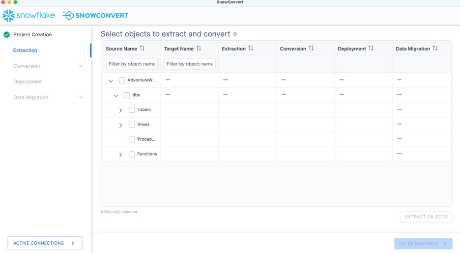

The catalog screen allows you to browse objects that were found in the database. For SQL Server, this could be tables, views, procedures, or functions. Nothing has been converted yet. This is merely an inventory of what SnowConvert found in the source.

Using the catalog, we can select a set of objects for which we'd like to extract the DDL. Using the filter options, you can search for a specific object or set of objects. Using the checkboxes, you can select a specific subset of objects or select the highest checkbox to select everything:

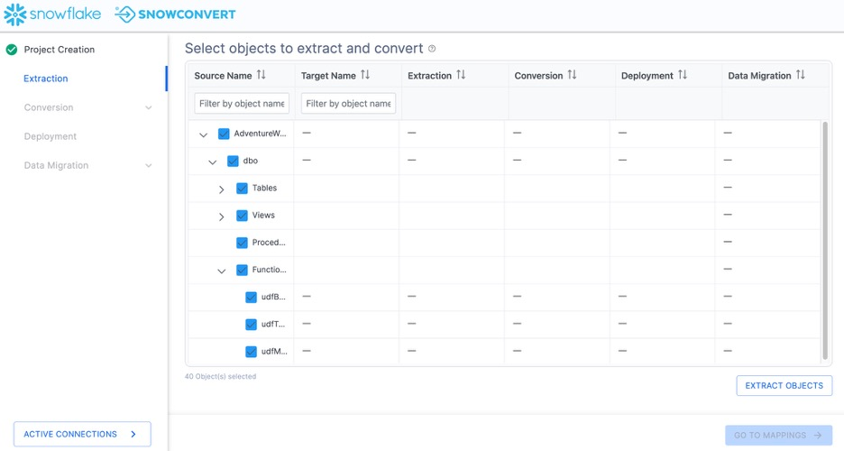

In this example, we will select the top checkbox and select everything. This will include tables, views, and functions. Then select "EXTRACT OBJECTS" to extract the DDL.

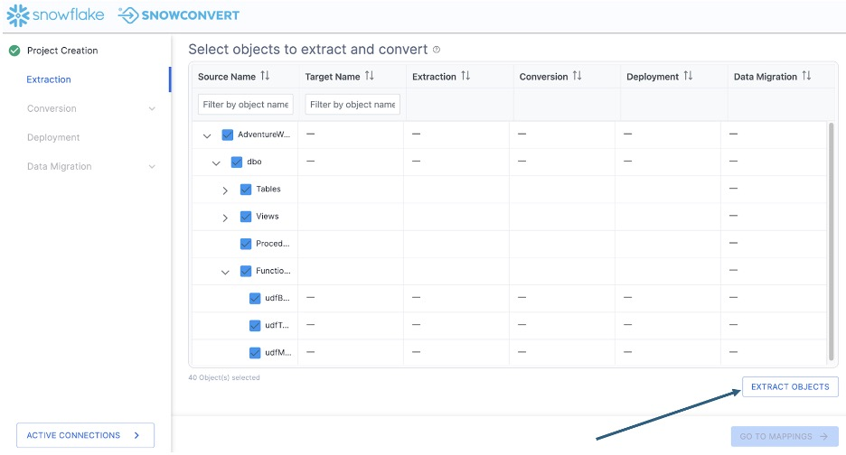

This will create a folder on the local machine preserving the structure of the objects in the database with a file for the DDL for each object.

When the extraction is complete, you will see a results screen similar to this:

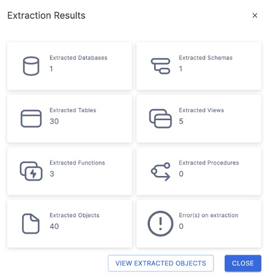

This will give you a brief overview of what was extracted. If there were errors or something was not able to be extracted, it will be reported to you here.

You can select "VIEW EXTRACTED OBJECTS" to see where SnowConvert put the extracted DDL.

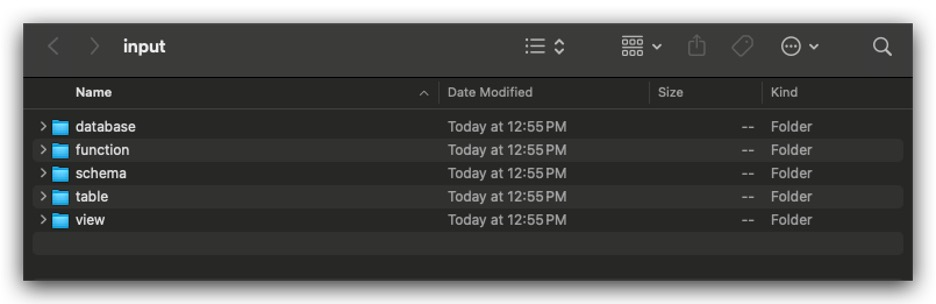

But since the number of objects we have extracted matches what we expected and there are no errors, we can **close** this dialog menu and return to the catalog.

Note that now we can see a green checkbox where the DDL was successfully extracted for the object:

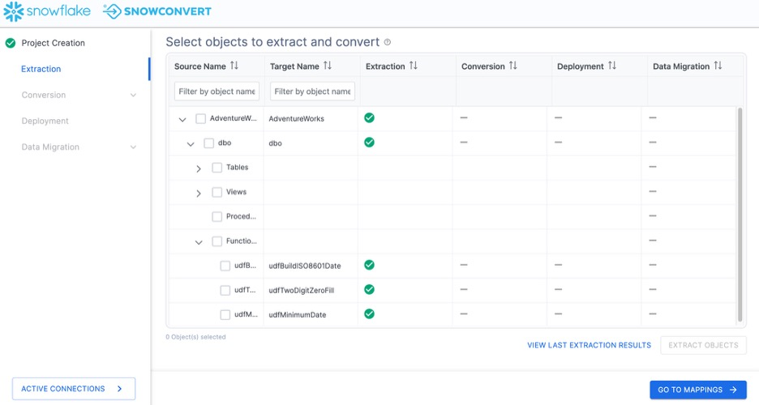

If there was an error extracting the DDL, you would see a red X and would need to resolve why that was not extracted.

## Step 3: Conversion

At this point, we've extracted the objects in the database and we're ready to assess the compatibility with Snowflake and begin the conversion process. There are some optional steps we can do before we get to the conversion itself. Let's take a look at this by selecting "GO TO MAPPINGS ->" in the bottom right corner of the application.

This brings us to the mapping screen.

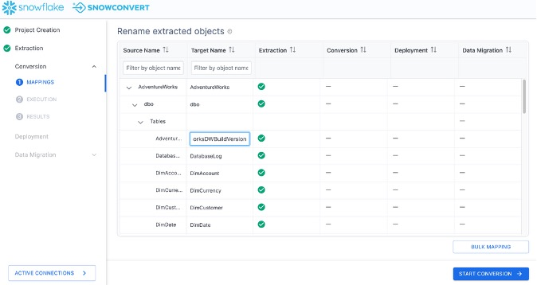

On this screen, you can choose a new name for a specific object in Snowflake (i.e. map a single object from SQL Server to Snowflake). You can also choose BULK MAPPING to apply a prefix or suffix to all of the objects or a subset of them (such as tables or view).

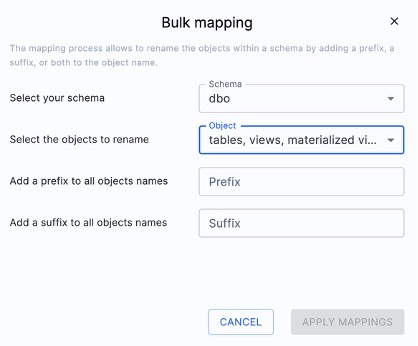

Note that this is completely optional when doing the migration. In this scenario, we will not do any custom mappings. **We will not do this** for the lab, but it is good to know that it is available. At the time of writing this lab, changing object names may have an adverse effect on dependent objects like views. For example, if I change a table name I will have to change the view definition to match the new table name. We plan on catching this in the future but at this time it is not the case.

Since we are leaving our object names unaffected, let's start the conversion process. Select "START CONVERSION" in the bottom right hand corner of the application.

You will view an error message similar to this one:

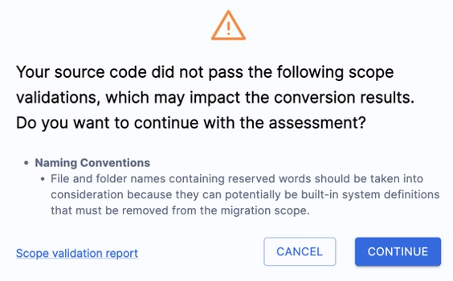

This simply means that SnowConvert has scanned the code that it extracted from the database before it runs its conversion script, and has found some things that COULD cause errors. It will tell you some things you might want to change in the source before converting. These can be found in the "Scope validation report" that you can read. In this scenario, **we'll just click "CONTINUE".**

SnowConvert will then execute its conversion engine. This is done by scanning the codebase and creating a semantic model of the source codebase. This model is then used by SnowConvert to create the output Snowflake code as well as the generated reports.

When the conversion is finished, each step will be highlighted:

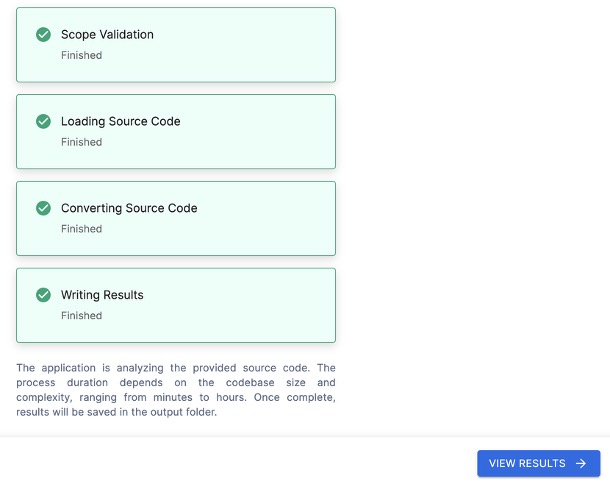

Select "VIEW RESULTS"

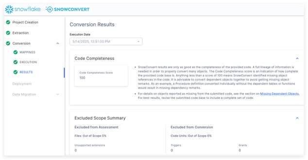

The results page will give you a code completeness score initially, but there is more information below if you scroll down. There is more information on each element of the output report [in the SnowConvert documentation](https://docs.snowconvert.com/sc/general/getting-started/running-snowconvert/review-results), but we'll just highlight a few elements of the report for this lab, and we'll do the followup for each of them which will explore more in depth.

**Code Completeness**: This is a reference to any missing elements or objects that are not present in the codebase. If you have 100% code completeness, then you do not have any missing objects or references to missing elements in the codebase.

Let's visit the additional reports that are generated by SnowConvert. Select "VIEW REPORTS" from the bottom of the application:

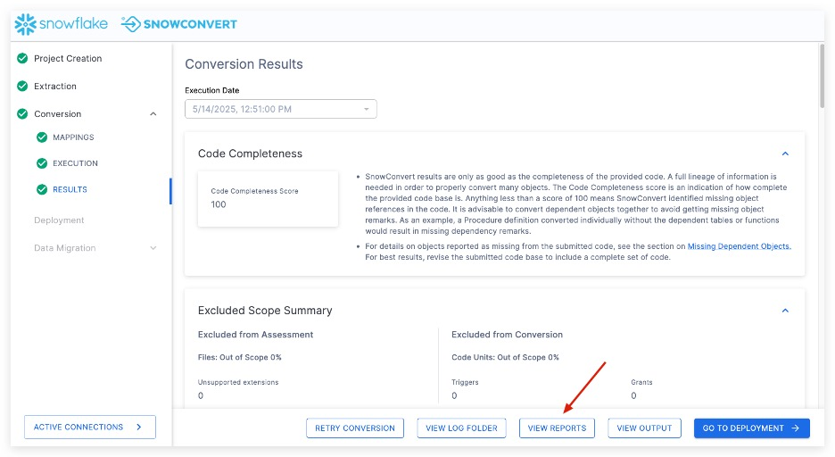

Here we can see all the files generated from the migration including Missing Objects or Issues or Elements. Since this is a demo most files are empty except for the Issues file which has a few items listed:

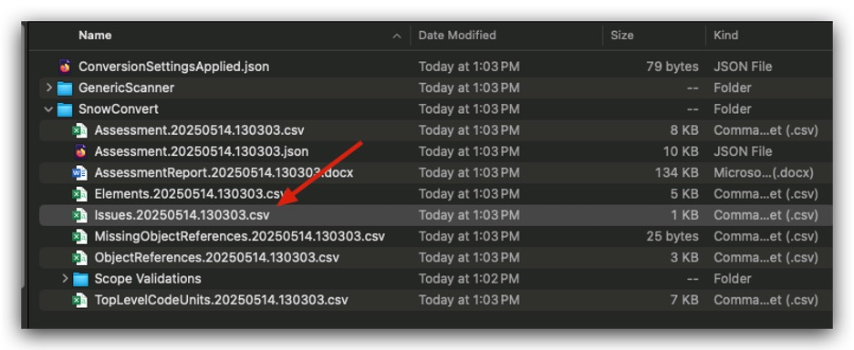

This is the contents of the Issues CSV file for your reference:

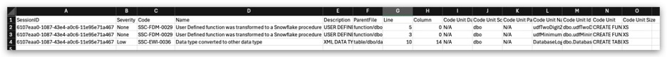

In this scenario, we have 100% code completeness. This makes sense given that we are exporting this directly from the source. If you do have missing objects here, the recommendation would be to open the reports folder and validate that the missing objects are either known to be missing or find the DDL for this object.

**Conversion Overview**: Now that we have seen that we have the code that we need for this, let's see how much of our code was converted. Let's review the Code Units Summary section. This section is in the main window just scroll down in the conversion results page:

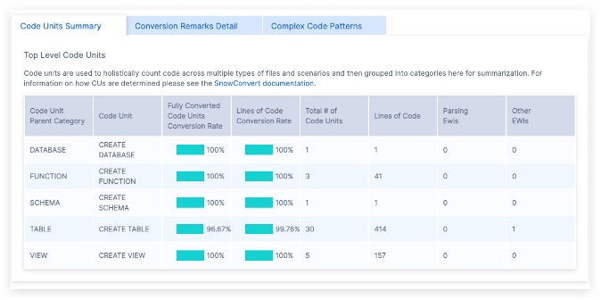

Looks like we have tables, views, and functions in this codebase, but not a lot of code in general (this looks like less than 1000 lines of code in total). There also is only one "EWI's" (in the last column), meaning that the majority of this extracted DDL can be moved over to Snowflake just by using SnowConvert. We'll look through the EWI's in a moment.

Understanding what we have is essential to successfully completing a migration. If we were pre-migration, we would likely stop here and review the object inventory. We'd also want to run the Snowpark Migration Accelerator (SMA) to validate that any pipelines we have include the objects that we are migrating here. In this scenario, we are going to go ahead and move forward to work through any issues that we have and will run the SMA later.

Since we have a good understanding of what needs to be done and it's relatively small, let's go ahead and attack this. Let's resolve the issues that we have present. Before we do that, let's take a look at the status in our object inventory. Select "GO TO DEPLOYMENT" in the application.

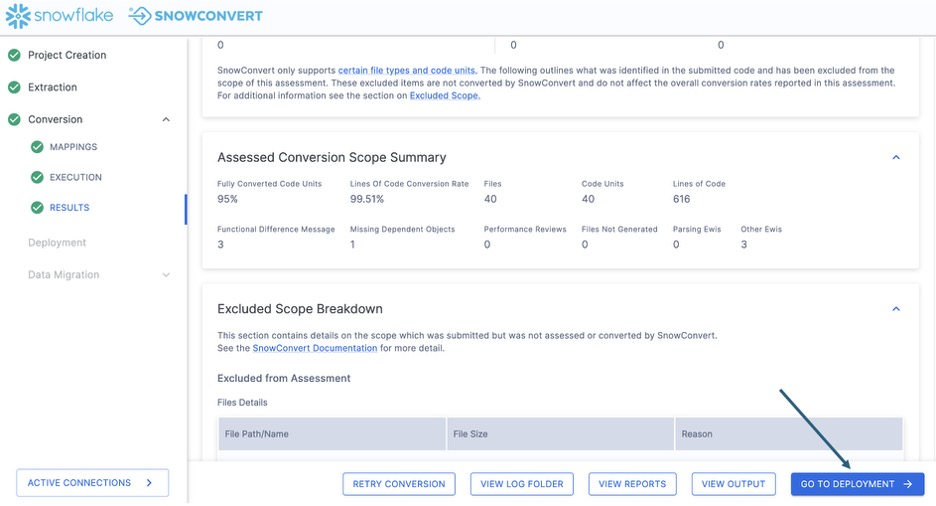

## Step 4: Deployment

This will take you back to the inventory screen. It should look something like this:

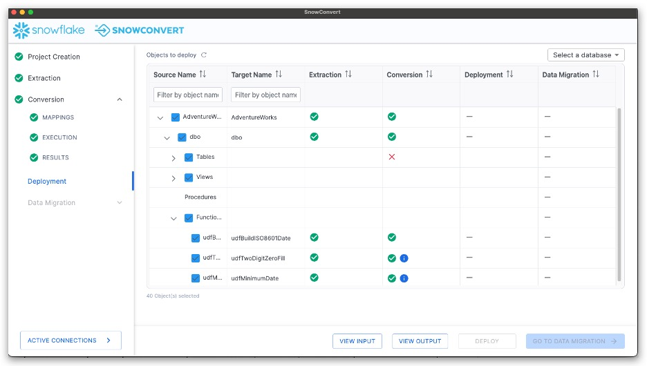

This is the same inventory that we have already seen, but note that now we can see a status in the conversion column. There are a few different elements that we can see here that are based on the conversion status. This lets us know which objects were fully converted (a green checkmark), which objects have a warning that you should consider (a green checkmark with a blue "i" icon), and which objects have a conversion error that must be addressed (a red "X").

These statuses are determined by the error messaging that SnowConvert has placed into the converted code. The objects with a red "X" have an error message that will produce an error if you attempt to run that SQL in Snowflake. If you resolve the errors, then you will be able to deploy the output code. As long as the converted files remain in the same directory where SnowConvert initially placed them after the source code conversion, SnowConvert will maintain its connection to your project directory.

Let's see this in action by resolving the issues.

### Resolving Issues (powered by AI)

SnowConvert will generate an inventory of all issues that it encounters. This is in the **issues.csv** file. Let's take a look at issues that we have available in this execution of SnowConvert.

To find the issues report, go to "VIEW OUTPUT" in the bottom of the SnowConvert application.

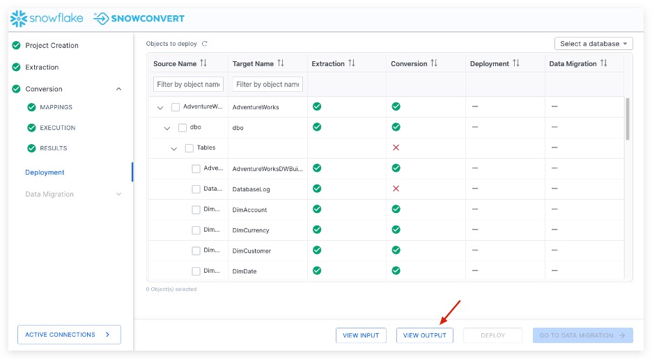

This will take you to a directory title "Conversion-\<datetime\>" within the directory you originally created in the project creation screen at the start of the project. This output will have three different sub directories:

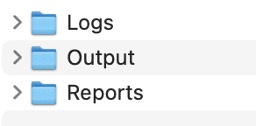

Let's first visit the reports directory to see what issues SnowConvert identified with this conversion.

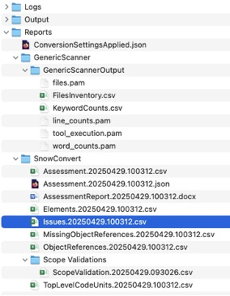

The issues.\<datetime\>.csv report will be available in the reports folder under the SnowConvert subfolder. In this report, you will find the type of each error as well as its location and a description of the error. There are three major types of error generated by SnowConvert:

- **Conversion Error (EWI)**: generally, this is something that the tool could not convert or hasn't seen before
- **Functional Difference (FDM)**: this is code that has been converted, but may be functionally different in Snowflake. These errors should be treated as warnings, but paid close attention to during testing.
- **Performance Reviews (PRM)**: this is something that SnowConvert identifies that will run in Snowflake, but may be suboptimal. You should consider optimizing this once you're up and running in Snowflake.

There's more information on each of these [in the SnowConvert documentation](https://docs.snowconvert.com/sc/general/technical-documentation/issues-and-troubleshooting). Let's look at what we have in this execution:

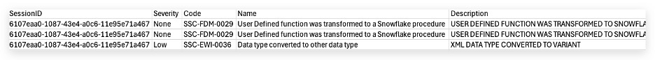

We can see that some issues share an issue code, but we can see specifically which file has the issue in it and a description of what the issue is. This is a very low number of issues. There will not be a ton of things to work through.

There are many approaches to dealing with the conversion issues generated by SnowConvert. We would recommend that you start in the same order you would want to deploy the objects: tables first, then views and functions, followed by procedures and scripts. You could pivot thi
